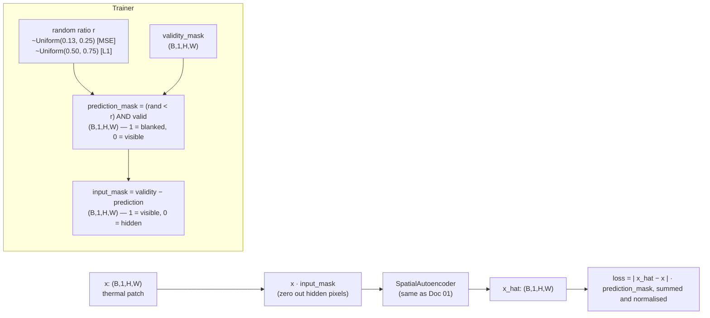
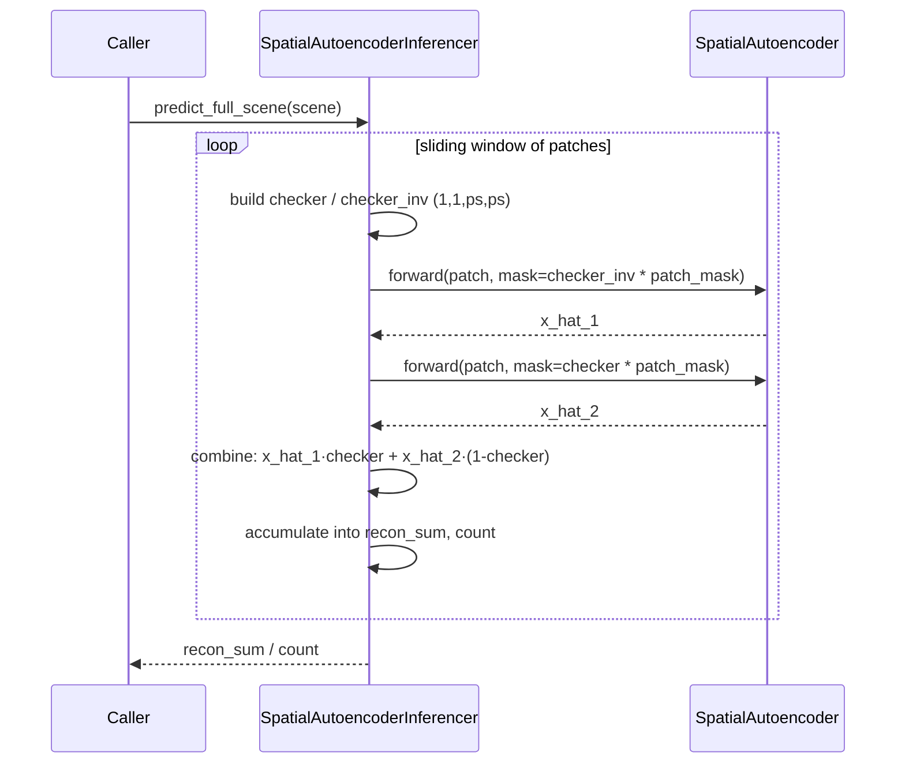

# 02 · Spatial Masked Autoencoder (thermal)

**Sensor:** Landsat 9 B10 thermal (single-band brightness temperature)
**Input shape:** `(B, 1, H, W)` — typically 128×128 patches
**Output shape:** `(B, 1, H, W)` reconstruction
**Variants:** `MSE` (v0.1.0), `L1` (v0.2.0, v0.4.0)

## What it solves and why this exists separately from `01`

The plain autoencoder (`01`) sees the whole patch and reconstructs the whole patch. There is nothing forcing it to "predict" anything — it could learn an identity-ish copy and still get low loss. To turn it into a real *prediction* model, this trainer **hides a random fraction of valid pixels before the forward pass** and only computes the loss on the hidden pixels.

This is the same idea as a Masked Autoencoder (MAE) but at the **pixel level** (instead of token level). Same architecture as `01`, different training recipe.

> Analogy: the difference between giving a student a textbook and asking them to read it (autoencoder) versus blanking out random words and asking them to fill them in (masked autoencoder). The second forces real understanding.

## Architecture

Same `SpatialAutoencoder` from `01`. The only thing that changes is **how the trainer feeds it data and where the loss is computed**.



The model does **not** know which pixels are blanked unless it can infer that from the zeros. There is no extra channel telling it "this pixel is hidden". Compare with `03_normalized_unnormalized_masked_autoencoder.md` where the masks *are* explicit channels.

## Tensor shape walk-through (one batch, training step)

| Step | Tensor | Shape | Notes |
|---|---|---|---|
| 1 | `pixels` | `(B, 1, 128, 128)` | Raw °C, from webdataset |
| 2 | `mask` (validity·cloud) | `(B, 1, 128, 128)` | 1 = valid + clear |
| 3 | filter <40% valid | drops some `B` | `pixels[keep]`, `mask[keep]` |
| 4 | `mask_ratio` | `(B, 1, 1, 1)` | One r per sample, U(0.13, 0.25) for MSE; U(0.50, 0.75) for L1 |
| 5 | `rand_map = rand_like(mask)` | `(B, 1, 128, 128)` | iid uniform[0, 1] |
| 6 | `prediction_mask` | `(B, 1, 128, 128)` | `(rand_map < ratio) & (mask == 1)` |
| 7 | `input_mask` | `(B, 1, 128, 128)` | `mask − prediction_mask` |
| 8 | model `forward(pixels, mask=input_mask)` | `(B, 1, 128, 128)` | hides pixels by zeroing |
| 9 | `x_hat` | `(B, 1, 128, 128)` | reconstruction |
| 10 | loss | scalar | only over `prediction_mask == 1` |

## Methods and classes used

| Symbol | File | Job |
|---|---|---|
| `SpatialAutoencoder` | [components/spatial_auto_encoder.py](../app/foundation_models/components/spatial_auto_encoder.py) | The same encoder–decoder as Doc 01. |
| `SpatialMaskedAutoencoderTrainer` | [trainers/spatial_masked_autoencoder_trainer.py](../app/foundation_models/trainers/spatial_masked_autoencoder_trainer.py) | MSE-loss trainer with 13–25 % masking. |
| `SpatialMaskedAutoencoderTrainerL1Loss` | [trainers/spatial_masked_autoencoder_trainer_l1_loss.py](../app/foundation_models/trainers/spatial_masked_autoencoder_trainer_l1_loss.py) | L1-loss trainer with 50–75 % masking. |
| (Inferencer reused) | [inferencers/spatial_autoencoder_inferencer.py](../app/foundation_models/inferencers/spatial_autoencoder_inferencer.py) | The same checkerboard inferencer as Doc 01 — checkpoint trained either way works. |

## Training

```mermaid
sequenceDiagram
    participant Loop as FoundationTrainer.train()
    participant T as SpatialMaskedAutoencoderTrainer{,L1Loss}
    participant M as SpatialAutoencoder
    participant Opt as Adam

    Loop->>T: compute_loss(batch)
    T->>T: build mask = validity · cloud
    T->>T: drop patches with <40% valid
    T->>T: ratio = U(min, max) per sample
    T->>T: prediction_mask = (rand < ratio) & valid
    T->>T: input_mask = mask − prediction_mask
    T->>M: forward(pixels, mask=input_mask)
    Note right of M: model zeros hidden<br/>pixels internally
    M-->>T: x_hat, _
    alt MSE variant
        T->>T: loss = ((x_hat − x)² · pred_mask).sum() / pred_mask.sum()
    else L1 variant
        T->>T: loss = (|x_hat − x| · pred_mask).sum() / pred_mask.sum()
    end
    T->>Opt: backward + step
    Loop->>Loop: scheduler.step
```

### Why two masking ratios?

- **MSE variant: U(0.13, 0.25)** — mild masking. The MSE loss is dominated by squared errors, which blow up if the prediction task is too hard. Fewer hidden pixels = easier task = stable MSE.
- **L1 variant: U(0.50, 0.75)** — aggressive masking. L1 is robust to large errors (linear, not quadratic), so we can afford to hide most of the patch and force genuinely difficult inpainting.

The L1 variant tends to converge to lower validation loss because the model is forced to learn richer spatial priors.

### What the validation step does

`compute_validation_loss()` is **not** the same as `compute_loss()`. At validation:

```
x_hat = model(pixels, mask=mask)         # full validity mask, no prediction blanking
loss  = (|x_hat − x| · mask).sum() / mask.sum()
```

That is, validation reports the reconstruction loss on **all valid pixels**. This is so val loss tracks reconstruction quality on a stable, comparable ground truth across epochs, not the noisy random-masking version.

## Inference

The L1 / MSE checkpoints are interchangeable with the spatial autoencoder of Doc 01. The inferencer is `SpatialAutoencoderInferencer` and uses checkerboard masking — same flow as Doc 01:



### Anomaly score at inference

```
A(i, j) = | x(i, j) − x_hat(i, j) |   for L1 variant
A(i, j) = ( x(i, j) − x_hat(i, j) )²  for MSE variant
```

## Configuration knobs

| Knob | Where | Effect |
|---|---|---|
| `mask_ratio` range | hard-coded in trainer | MSE: 0.13–0.25. L1: 0.50–0.75. |
| `MIN_VALID_PIXEL_FRACTION` | trainer constant = 0.4 | Patches with less than 40% valid pixels are dropped from the batch. |
| `pixel_stats_path` | config | Path to JSON with `{"mean":[...],"std":[...]}` for normalisation. |

## Analogies and gotchas

- **Per-sample random masking ratio** — every patch in a batch gets its own ratio drawn uniformly from the range, not a single fixed value. This makes the model robust to different masking densities at inference. Helpful when the inference checkerboard cell size changes.
- **Why a per-pixel random mask, not a per-block one?** A pixel-level random mask gives the model many independent prediction problems per patch (good for gradient signal). At inference we use a *structured* checkerboard instead, because at inference we want every pixel to be predicted exactly once, not haphazardly.
- **The model never sees `prediction_mask` directly.** It only ever sees `pixels * input_mask`. Hidden pixels reach the encoder as zeros. This is sometimes called "naive masking" — versus "explicit masking" where the validity / input mask is concatenated as channels (see Doc 03).
- **Inference uses a checkerboard, training uses random.** This mismatch is intentional: the training random mask is harder than the inference checkerboard (which always leaves an immediate neighbour visible). The model trained on the harder task generalises to the easier one well.

## Checkpoints in this repo

| Checkpoint | Loss | Params | Notes |
|---|---|---:|---|
| `spatial_masked_autoencoder_v0.1.0_epoch121.pt` | MSE | 265 480 | 2-stage encoder (1 → 64 → 128). |
| `spatial_masked_autoencoder_l1_v0.2.0_epoch92.pt` | L1 | 265 480 | Same architecture, L1 loss. |
| `spatial_masked_autoencoder_l1_v0.4.0_epoch77.pt` | L1 | 330 314 | 3-stage encoder (1 → 32 → 64 → 128). Lowest val loss in the family at 1.79. |
