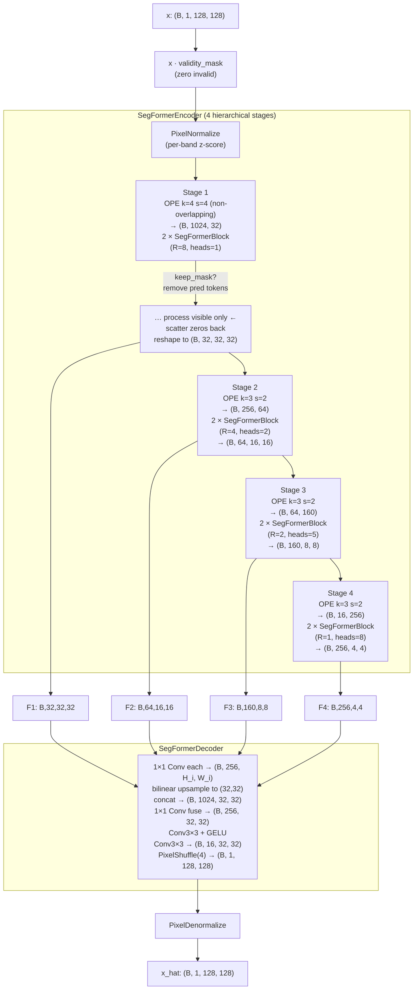
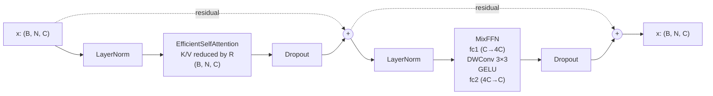
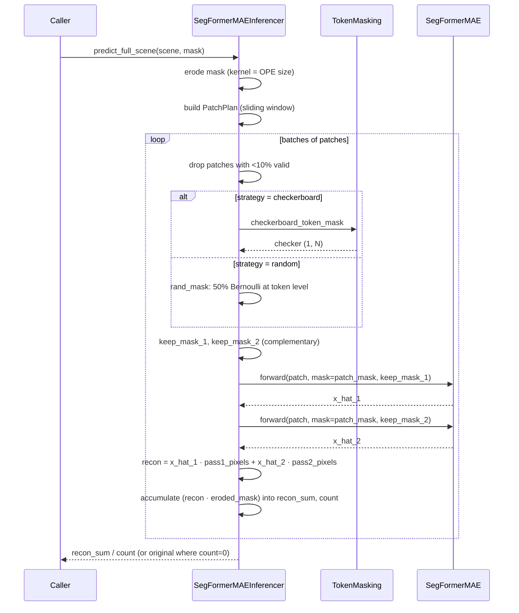

# 04 · SegFormer MAE (thermal)

**Sensor:** Landsat 9 B10 thermal (single-band)
**Input shape:** `(B, 1, H, W)` — patches must be divisible by 32 (typically 128×128)
**Output shape:** `(B, 1, H, W)` reconstruction

## What this model is

This is a **Masked Autoencoder built on a SegFormer backbone**, doing *true MAE token removal* — prediction-target tokens are physically dropped from the encoder's input sequence, not just zeroed. It is the most sophisticated thermal model in the repo.

If you've seen the original Facebook MAE paper for ViT, this is the same idea but with a **hierarchical** transformer (4 stages instead of one flat ViT), efficient attention, and a multi-scale decoder.

> Mental model: a CNN scans a fixed neighbourhood with a small filter. A vanilla transformer compares every pixel to every other pixel — quadratic cost. SegFormer hits a compromise: do attention over **tokens** (4×4 pixel patches), and at each stage compress the spatial grid further. By stage 4 there are only 16 tokens, which is cheap. By stage 1 there are 1024, which is where you spend most of your budget.

## Five things SegFormer does that vanilla ViT doesn't

1. **Hierarchical, not flat.** 4 stages, each halves H/W and grows channels — like a CNN.
2. **Overlap patch embedding.** Adjacent tokens share input pixels — preserves continuity at token boundaries.
3. **Efficient self-attention (ESA).** Spatially compresses K and V by a stage-specific reduction ratio R, so attention cost drops from O(N²) to O(N²/R²).
4. **Mix-FFN.** The FFN has a depthwise 3×3 conv between the two linear layers — gives the model spatial awareness without explicit positional encodings.
5. **Pixel-shuffle decoder.** Final upsampling rearranges learned sub-pixel channels into a 4×4 spatial block — every pixel gets its own predicted value, no bilinear blurring.

## Architecture overview



The default config (used by both checkpoints):

| Stage | Embed dim | Heads | Reduction R | Blocks | Token grid (for 128×128 input) |
|---:|---:|---:|---:|---:|---|
| 1 | 32 | 1 | 8 | 2 | 32×32 = **1024 tokens** |
| 2 | 64 | 2 | 4 | 2 | 16×16 = 256 tokens |
| 3 | 160 | 5 | 2 | 2 | 8×8 = 64 tokens |
| 4 | 256 | 8 | 1 | 2 | 4×4 = 16 tokens |

This is the SegFormer-B0 config.

## What goes on inside one transformer block



Pre-norm residuals: `LayerNorm` runs **before** each sublayer, and the residual highway is never normalised — gradients flow through unmodified.

### Efficient Self-Attention (ESA), explained slowly

Standard attention computes Q, K, V for all N tokens, then computes an N×N matrix of scores. At Stage 1 with N = 1024, that's a million entries per head. Expensive.

ESA's trick: keep **Q at full resolution** (1024 tokens) but spatially compress **K and V** by reduction ratio R. With R = 8 at Stage 1:
- Reshape token sequence back to 2D `(B, C, 32, 32)`
- Apply `Conv2d(kernel=8, stride=8)` → `(B, C, 4, 4)`
- Flatten back → 16 reduced tokens
- Compute attention `(1024 × 16)` instead of `(1024 × 1024)`

The interpretation: queries ask fine-grained questions ("what's around me?"), but keys/values provide spatially-aggregated answers (a single K/V token summarises an 8×8 region of input tokens). It's like asking 1024 students each a question, but with only 16 teachers — each teacher covers 64 students.

**Cost:** `O(N²/R²)` per head instead of `O(N²)`. Massive saving at Stage 1.

### MAE token removal — the *true* masking

This is what makes it an MAE rather than just a SegFormer. At Stage 1:

1. After OPE you have `(B, 1024, 32)` — 1024 tokens of 32 dimensions.
2. The trainer hands the encoder a `keep_mask` of shape `(B, 1024)` with ~50% ones (visible) and ~50% zeros (prediction targets).
3. `TokenMasking.remove_tokens(x, keep_mask)` **physically deletes** the prediction tokens from the sequence: `(B, 512, 32)`.
4. The 2 transformer blocks at Stage 1 process only 512 tokens. Encoder cost drops, and crucially the encoder *cannot peek at the prediction targets* through any attention path.
5. After Stage 1, `TokenMasking.restore_tokens(...)` scatters the encoded 512 tokens back into the full 1024-token grid. Prediction positions become zero.
6. Reshape to 2D `(B, 32, 32, 32)` — prediction positions are zero blobs in the spatial grid.
7. Stage 2's OPE has stride 2, so its 3×3 conv pools over neighbours — most Stage 2 tokens contain at least *some* real signal. The information loss naturally dilutes through the hierarchy.
8. Stages 2–4 process all tokens normally.

**Why is this better than just zeroing pixels in the input?** Two reasons:
- **Computation.** The encoder doesn't waste FLOPs on tokens whose value is zero anyway.
- **Cleaner self-supervision.** The decoder *must* reconstruct prediction positions from non-prediction context; there is no path through which the encoder could see a target token's value.

## Methods and classes used

| Symbol | File | Job |
|---|---|---|
| `SegFormerMAE` | [components/seg_former_mae.py](../app/foundation_models/components/seg_former_mae.py) | Top-level wrapper: normalize → encoder → decoder → denormalize. |
| `SegFormerEncoder` | [components/seg_former_encoder.py](../app/foundation_models/components/seg_former_encoder.py) | 4-stage hierarchical encoder; handles MAE token removal at Stage 1. |
| `SegFormerBlock` | [components/segformer_block.py](../app/foundation_models/components/segformer_block.py) | One transformer block (Pre-norm ESA + Pre-norm MixFFN, both with residuals). |
| `EfficientSelfAttention` | [components/efficient_self_attention.py](../app/foundation_models/components/efficient_self_attention.py) | Multi-head attention with K/V spatial reduction. |
| `MixFFN` | [components/mix_ffn.py](../app/foundation_models/components/mix_ffn.py) | Two linears with a 3×3 depthwise conv in the middle. |
| `OverlapPatchEmbedding` | [components/overlap_patch_embedding.py](../app/foundation_models/components/overlap_patch_embedding.py) | Conv that turns 2D feature maps into token sequences. |
| `SegFormerDecoder` | [components/seg_former_decoder.py](../app/foundation_models/components/seg_former_decoder.py) | Unify channels → upsample to common scale → concat → fuse → PixelShuffle. |
| `TokenMasking` | [components/token_masking.py](../app/foundation_models/components/token_masking.py) | Static utilities: `pixel_mask_to_token_mask`, `generate_prediction_mask`, `remove_tokens`, `restore_tokens`, `checkerboard_token_mask`, `erode_mask`. |
| `PixelNormalize` / `PixelDenormalize` | [components/pixel_normalization.py](../app/foundation_models/components/pixel_normalization.py) | Per-band z-score and inverse. |
| `SegFormerMAETrainer` | [trainers/segformer_mae_trainer.py](../app/foundation_models/trainers/segformer_mae_trainer.py) | Training loop, mask generation, L1 loss with optional trimming. |
| `SegFormerMAEInferencer` | [inferencers/segformer_mae_inferencer.py](../app/foundation_models/inferencers/segformer_mae_inferencer.py) | Two-pass token-level masking + sliding-window full-scene reconstruction. |

## Training

```mermaid
sequenceDiagram
    participant Loop as FoundationTrainer.train
    participant T as SegFormerMAETrainer
    participant TM as TokenMasking
    participant M as SegFormerMAE

    Loop->>T: compute_loss(batch)
    T->>T: validity = pure_validity * predicted_cloud_mask
    T->>T: drop patches with <40% valid
    T->>TM: pixel_mask_to_token_mask(validity, k=4, s=4)
    TM-->>T: token_mask (B, 1024)
    T->>TM: generate_prediction_mask(token_mask, mask_ratio=0.5)
    TM-->>T: keep_mask (B,1024), pred_mask (B,1024)
    T->>M: forward(pixels, mask=validity, keep_mask=keep_mask)
    Note over M: encoder physically removes<br/>pred tokens at Stage 1
    M-->>T: x_hat (B,1,H,W)
    T->>T: pixel_pred_mask = upsample(pred_mask) to (B,1,H,W)
    T->>TM: erode_mask(validity, kernel=1)
    T->>T: loss_mask = pixel_pred_mask * eroded_mask
    T->>T: per_pixel_loss = |x_hat − x|
    T->>T: valid_losses = per_pixel_loss[loss_mask==1]
    alt trim_fraction > 0
        T->>T: sort, drop top τ%, mean of bottom (1-τ)%
        Note right of T: top errors are likely<br/>real anomalies — drop them<br/>so model trains on normal only
    else
        T->>T: loss = valid_losses.mean()
    end
```

### Loss

```
L = mean of   |x_hat − x|     over pixels where  pred_mask=1 AND validity=1 AND not boundary
```

With **trimmed loss** (controlled by `cfg.trim_fraction`):

```
L = mean of bottom (1 - τ)%  of those per-pixel losses
```

Trimming is the trainer's defence against unlabelled anomalies in training data. Pixels with the highest reconstruction errors are likely real anomalies that *shouldn't* be reconstructed well. Dropping them from the loss prevents the model from learning to reproduce hot spots.

### Edge erosion

Token validity is computed at the OPE receptive field. Pixels right at the boundary of an invalid region have OPE receptive fields that overlap invalid pixels — their reconstructions are unreliable. `TokenMasking.erode_mask(mask, kernel=1)` shrinks the valid region so the loss skips these untrustworthy boundary pixels.

### Validation: two-pass random masking

Validation does the same kind of two-pass random masking as inference (below) so the loss is comparable to inference quality. It splits valid tokens randomly 50/50, runs two forward passes (each with the complement masked), combines per-pixel reconstructions from the pass that hid each pixel, and reports the L1 error against ground truth on all *interior-valid* pixels.

## Inference



### Anomaly score

```
A(i, j) = | x(i, j) − x_hat(i, j) |
```

L1 residual per pixel, just like training.

## Configuration knobs

| Knob | Where | Effect |
|---|---|---|
| `mask_ratio` | training config | Fraction of valid tokens to mask. Default 0.5. |
| `trim_fraction` | training config | Drop top τ% per-pixel losses (0 disables). Defends against unlabelled anomalies. |
| `erosion_kernel_size` | training & inference | Boundary buffer in pixels. Default 1. |
| `embed_dims, num_heads, reduction_ratios, num_blocks` | model config | Backbone shape. Default = SegFormer-B0. |
| `decoder_dim` | model config | Common channel dim in decoder fusion. Default 256. |
| `expansion_ratio` | model config | MixFFN hidden multiplier. Default 4. |
| `masking_strategy` | inference config | `"checkerboard"` (deterministic) or `"random"` (50/50). |
| `checkerboard_cell_size` | inference config | Cell size in tokens (1 = single-token alternation). |
| `inference_batch_size` | inference config | How many patches to GPU-batch through `forward` per pass. |
| `patch_size, stride` | inference config | Sliding-window dimensions. `stride = patch_size // 2` is typical. |

## Analogies and gotchas

- **Why pixel-shuffle and not bilinear upsampling?** Bilinear takes 16 reconstructed values and *averages* them into 16 output pixels — a 1-pixel anomaly gets diluted into its 4×4 neighbourhood. Pixel shuffle takes `out_channels × 16` channels and rearranges them so each output pixel comes from its own learned channel — a sharp 1-pixel anomaly stays sharp. This matters for point-source anomalies like wildfires.
- **Stage 1 is special.** OPE is non-overlapping (kernel = stride = 4) so each token covers exactly its own 4×4 block. This is critical for MAE: if Stage 1 were overlapping, prediction tokens would leak signal into neighbouring tokens via the overlap. Stages 2–4 use overlapping (kernel=3, stride=2) because there's no token removal there.
- **The Stage 1 token grid is bigger than you'd think.** For a 128×128 patch, Stage 1 has 1024 tokens — that's where 90 % of the compute and 90 % of the memory live. The other stages are downstream cleanup.
- **`keep_mask` versus `pred_mask` versus `pixel_pred_mask`** — all three exist:
  - `keep_mask` (B, N): 1 = keep in encoder, 0 = remove. **Token level.**
  - `pred_mask` (B, N): 1 = prediction target. Token level. Always the complement of the visible-valid portion.
  - `pixel_pred_mask` (B, 1, H, W): pred_mask upsampled to pixel resolution, used for the loss.
- **`pixel_mask_to_token_mask` uses average pooling with the same kernel/stride as OPE**, not max pooling. It then thresholds at >50%: a token is valid iff more than half its receptive field is valid. This avoids penalising tokens that overlap a thin sliver of cloud.

## Checkpoints in this repo

| Checkpoint | Config | Params |
|---|---|---:|
| `segformer_mae_v0.1.0_epoch10.pt` | full SegFormer-B0 (`[32,64,160,256]`, 2 blocks/stage) | 3.71 M |
| `segformer_mae_v0.8.0_epoch495.pt` | shrunk variant (`[16,32,64,96]`, 1 block/stage) | 406 K |

The v0.8.0 has 9× fewer params, runs 495 epochs, and lands at val L1 ≈ 0.26 — competitive at a fraction of the size.
