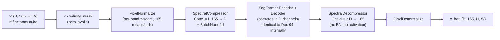
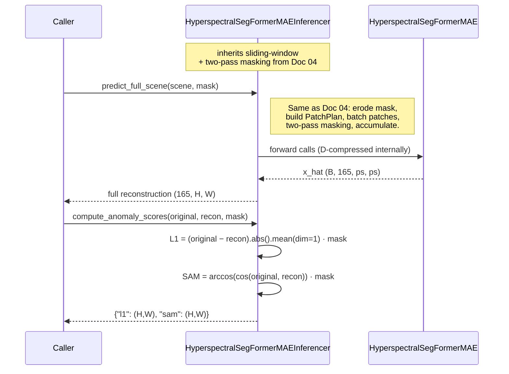

# 05 · Hyperspectral SegFormer MAE

**Sensors:** PRISMA + EnMAP — both resampled to a common 165-band 10 nm grid (460–2450 nm) before feeding the model.
**Input shape:** `(B, 165, H, W)` — typically 128×128 patches
**Output shape:** `(B, 165, H, W)` reconstructed reflectance cubes

## What this model is

This is the thermal SegFormer MAE (Doc 04) with two changes:

1. **A learnable spectral compressor / decompressor** wraps the SegFormer encoder. 165 input bands are squeezed down to D channels (24 in v0.1.0, 32 in v0.2.0) before entering the SegFormer, and decompressed back to 165 after. Think of it as a learned, end-to-end-trained alternative to MNF (Minimum Noise Fraction) compression.
2. **L1 + SAM combined loss.** L1 alone catches *magnitude* errors. SAM (Spectral Angle Mapper) catches *shape* errors — a spectrum can be the right brightness but the wrong colour, and only SAM penalises that.

Everything else — token masking, training masking, inference checkerboard, sliding-window full-scene reconstruction — is inherited from Doc 04.

## The big idea: learned spectral compression

Hyperspectral cubes have a lot of redundant bands. Adjacent wavelengths are highly correlated; many bands sit in atmospheric absorption windows; some bands are pure noise. A single 1×1 conv can collapse 165 channels to D channels at every pixel:

```
x : (B, 165, H, W)
y = Conv2d(165, D, kernel=1)(x)  →  (B, D, H, W)
```

That conv has `165 × D + D` learnable parameters (+ a BatchNorm). It learns, end-to-end with the rest of the network, the linear combination of bands that best supports reconstruction. With D=24, the SegFormer behind it operates on 24 channels instead of 165 — drastically cheaper, and the encoder's first patch embedding stays small.

> Analogy: MNF is "find the principal axes of a noise-aligned PCA". This conv-1×1 compressor is "let the network choose its own axes during training". The math is the same shape (linear projection); the basis is different.

The **decompressor** is another `Conv2d(D, 165, kernel=1)` after the SegFormer decoder, with no BatchNorm and no activation — it must produce unconstrained values for `PixelDenormalize` to scale back to reflectance.

## Architecture



### Tensor walk-through (D = 24, 128×128 patches)

| Tensor | Shape | What it represents |
|---|---|---|
| `x` | `(B, 165, 128, 128)` | Reflectance cube on common grid |
| After `PixelNormalize` | `(B, 165, 128, 128)` | Per-band z-score |
| After `SpectralCompressor` | `(B, 24, 128, 128)` | Learned spectral basis projection |
| Stage 1 of SegFormer | `(B, 24, 128, 128)` → tokens `(B, 1024, 32)` | OPE k=4 s=4 over 24 channels |
| Stage 2 | `(B, 64, 16, 16)` | |
| Stage 3 | `(B, 160, 8, 8)` | |
| Stage 4 | `(B, 256, 4, 4)` | |
| Decoder fused | `(B, 256, 32, 32)` | |
| PixelShuffle out | `(B, 24, 128, 128)` | reconstruction in compressed space |
| `SpectralDecompressor` | `(B, 165, 128, 128)` | back to full spectral resolution |
| `PixelDenormalize` | `(B, 165, 128, 128)` | back to reflectance |

## Why two loss terms — L1 *and* SAM?

A spectral pixel is a 165-vector. Two such vectors can disagree in two ways:

| Disagreement | Caught by L1 | Caught by SAM |
|---|---|---|
| **Magnitude** — e.g. `[0.4, 0.5, 0.6]` vs `[0.6, 0.5, 0.4]` (same dot product, different per-band) | yes | partly |
| **Shape** — e.g. `[0.1, 0.2, 0.3]` vs `[0.2, 0.4, 0.6]` (perfect 2× scale, identical shape) | yes | **no** (cosine = 1) |
| **Brightness only** — same shape, different overall scale | yes | **no** |
| **Hue only** — same brightness, different shape | small | **yes** |

So:
- **L1 alone** is sensitive to bright-spectrum scenes — it spends gradient on getting brightness right.
- **SAM alone** is invariant to brightness — it only cares about shape. But it also collapses to zero for any colinear pair, missing magnitude errors.

Combining them gives the model a clean, decoupled objective: get the shape right (SAM) AND the brightness right (L1).

### SAM, in math

```
SAM(a, b) = arccos( (a · b) / (||a|| · ||b||) )    radians
```

Computed per-pixel (the dot/sums are over the 165-band axis). Range: `[0, π]`. In practice for normal reflectance: 0.01 – 0.1 rad (0.6° – 5.7°).

### Combined loss

```
L_total(t) = L1(x_hat, x; loss_mask)  +  λ(t) · SAM(x_hat, x; loss_mask)
```

where `λ(t)` ramps **linearly** from 0 to `cfg.sam_weight` over `cfg.sam_ramp_epochs`. Why ramp? At the start of training the model can't even get magnitudes right; piling on a shape penalty would just make optimisation unstable. The ramp lets L1 dominate early, then gradually tightens the spectral-shape constraint as the model stabilises.

### `SAMLoss` numerical stability

The naive `arccos(cos_sim)` has infinite gradient at `±1`. The repo's [`SAMLoss`](../app/foundation_models/components/sam_loss.py) uses `atan2(sin_term, cos_term)` instead — same value, finite gradient everywhere. The sin term is computed from the cross-product magnitude relation `||a||·||b||·sin(θ) = sqrt((||a||·||b||)² − (a·b)²)`.

## Methods and classes used

| Symbol | File | Job |
|---|---|---|
| `HyperspectralSegFormerMAE` | [components/hyperspectral_seg_former_mae.py](../app/foundation_models/components/hyperspectral_seg_former_mae.py) | Top-level wrapper: normalize → compress → SegFormer → decompress → denormalize. |
| `SpectralCompressor` | [components/spectral_compressor.py](../app/foundation_models/components/spectral_compressor.py) | `Conv2d(in=165, out=D, k=1)` + `BatchNorm2d`. |
| `SpectralDecompressor` | same file | `Conv2d(in=D, out=165, k=1)`, no BN/activation. |
| `SegFormerEncoder` / `SegFormerDecoder` | (see Doc 04) | Operate over D channels, not 165. |
| `SAMLoss` | [components/sam_loss.py](../app/foundation_models/components/sam_loss.py) | Spectral angle loss with `atan2`-stable backwards. |
| `HyperspectralSegFormerMAETrainer` | [trainers/hyperspectral_segformer_mae_trainer.py](../app/foundation_models/trainers/hyperspectral_segformer_mae_trainer.py) | Training loop with combined loss + ramp + gradient accumulation. |
| `HyperspectralSegFormerMAEInferencer` | [inferencers/hyperspectral_segformer_mae_inferencer.py](../app/foundation_models/inferencers/hyperspectral_segformer_mae_inferencer.py) | Inherits from `SegFormerMAEInferencer`; adds dual-score (L1, SAM) anomaly scoring. |

## Training

```mermaid
sequenceDiagram
    participant Loop as FoundationTrainer.train
    participant T as HyperspectralSegFormerMAETrainer
    participant TM as TokenMasking
    participant M as HyperspectralSegFormerMAE
    participant SAM as SAMLoss
    participant Opt as Adam (with grad accumulation)

    Loop->>T: compute_loss(batch)
    T->>T: validity = validity_cube[:, 0:1] (band-0 proxy)
    T->>T: drop patches with <40% valid
    T->>TM: pixel_mask_to_token_mask(validity, k=4, s=4)
    TM-->>T: token_mask
    T->>TM: generate_prediction_mask(token_mask, mask_ratio)
    TM-->>T: keep_mask, pred_mask
    T->>M: forward(pixels, mask=validity, keep_mask=keep_mask)
    Note over M: compress 165→D, run SegFormer,<br/>decompress D→165
    M-->>T: x_hat (B, 165, H, W)
    T->>T: pixel_pred_mask = upsample(pred_mask)
    T->>TM: erode_mask(validity, kernel=cfg.erosion_kernel_size)
    T->>T: loss_mask = pixel_pred_mask · eroded_mask
    T->>T: per_pixel_l1 = |x_hat − x|.mean(dim=1, keepdim=True)
    T->>T: l1 = per_pixel_l1[loss_mask==1].mean()
    T->>SAM: SAMLoss(x_hat, x, loss_mask)
    SAM-->>T: sam_loss (scalar, radians)
    T->>T: λ = sam_weight · min(1, epoch / ramp_epochs)
    T->>T: loss = l1 + λ · sam_loss
    T->>Opt: backward (scaled by 1/accum_steps if accumulating)
    Opt->>Opt: every N steps: step + zero_grad
```

### Why band-0 as the validity proxy?

The hyperspectral preprocessing pipeline produces a *binary* validity cube — every pixel is either fully valid across all bands or fully invalid. So band 0 is identical to band 17 is identical to band 164. Reading band 0 saves 165× memory traffic.

### Gradient accumulation

`HyperspectralSegFormerMAE` is bigger than the thermal one (5.2–5.5 M params, 165-band cubes are bigger), so even small batches strain GPU memory. The trainer overrides `_run_train_pass` to accumulate gradients over N mini-batches before stepping. The loss is **scaled by 1/N** so the eventual gradient magnitude matches what a single batch of size `B·N` would have produced — same effective learning rate, smaller per-step memory.

### Validation

Two-pass random masking, identical to Doc 04, but:
- L1 component computed band-mean → mean across spatial loss-mask.
- SAM component computed by `SAMLoss` over the same loss mask.
- Combined `loss = l1 + λ · sam`.

## Inference



### Two anomaly scores

The inferencer returns a dictionary, not a single map. Each score has different sensitivities:

| Score | Captures | Use it when |
|---|---|---|
| **L1** | Per-pixel magnitude error in reflectance | You expect anomalies to differ in *brightness* (e.g. specular surfaces, water in unexpected places) |
| **SAM** | Per-pixel spectral-angle error in radians | You expect anomalies to differ in *spectral signature* (e.g. unique materials, gas plumes) |

A downstream consumer can fuse them however it likes (max, product, normalised sum). The inferencer keeps them separate to give you control.

## Configuration knobs

| Knob | Where | Effect |
|---|---|---|
| `compressed_channels` | model config | D — bottleneck spectral dim. v0.1.0 = 24, v0.2.0 = 32. |
| `mask_ratio` | training config | Token mask fraction. |
| `sam_weight` | training config | Final value of λ in L1 + λ·SAM. |
| `sam_ramp_epochs` | training config | Epochs over which to linearly ramp λ from 0. |
| `erosion_kernel_size` | training & inference | Boundary buffer in pixels. |
| `gradient_accumulation_steps` | training config | Mini-batches accumulated per optimiser step. |
| `embed_dims, num_heads, reduction_ratios, num_blocks` | model config | SegFormer backbone — defaults match B0. |
| `decoder_dim` | model config | Default 256. |
| All Doc 04 inference knobs | inference config | Strategy, cell size, batch size, patch size, stride. |

## Analogies and gotchas

- **The compressor is *not* MNF, but it is MNF-shaped.** MNF is an offline, eigendecomposition-based linear projection that maximises signal-to-noise. The compressor is the same *kind* of object (a linear projection with shape `(D, 165)`) but its weights are learned from the reconstruction objective, not from noise statistics. In practice the two often produce broadly similar bases for the leading components.
- **D is small.** v0.1.0 picks D=24, v0.2.0 picks D=32. Why so small? Because the SegFormer's first stage was originally designed for ~32 input channels (the embed_dim of Stage 1). Going much larger blows up Stage 1's parameters. Going smaller risks losing too much spectral info. 24–32 is the sweet spot.
- **`SpectralDecompressor` deliberately has no BatchNorm.** BatchNorm would force every spatial position's reconstructed spectrum to be zero-mean unit-variance per output band. Real reflectance spectra are decidedly not zero-mean. The decompressor must be free to produce any value.
- **`pixel_stats_path` is critical.** The model expects 165 means and 165 stds. Mismatched stats at inference produce ugly per-band offsets in the reconstruction.
- **Why is band-0 validity sufficient?** Because the upstream pipeline (`SpectralBandFilter` → `SpectralInterpolator` → `SpectralResampler`) makes validity binary across bands at the spatial level. See `CONTEXT.md` and `docs/spectral_band_filtering_report.md` for the full pipeline.
- **Inference returns a *dict* of scores.** Don't index into it as a tensor — `result["l1"]` and `result["sam"]` are the (H,W) maps.

## Checkpoints in this repo

| Checkpoint | D | Total params |
|---|---:|---:|
| `hyperspectral_segformer_mae_v0.1.0_epoch{2,60,63,84,92}.pt` | 24 | 5.21 M |
| `hyperspectral_segformer_mae_v0.2.0_epoch{2,55,80,200}.pt` | 32 | 5.51 M |

Best validation L1 in the v0.1.0 family: epoch 92 at 0.077. v0.2.0 epoch 2 hits 0.035 (lr=1e-3 was too aggressive; later epochs regress to ~0.04).
