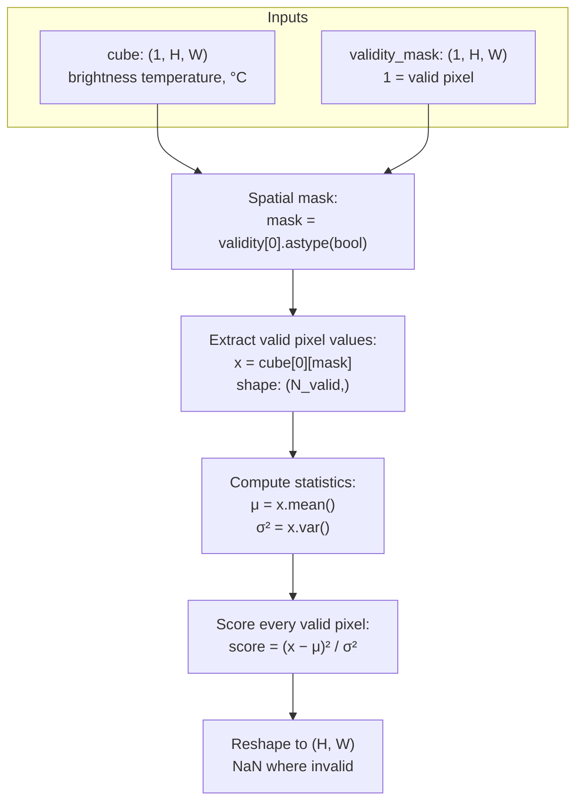

# 06 · Thermal Global RX (statistical, single-band)

**Sensor:** Landsat 9 B10 thermal (single band)
**Input shape:** `(C=1, H, W)` numpy array of brightness temperature in °C, plus optional `(1, H, W)` validity mask
**Output shape:** `(H, W)` per-pixel anomaly score; NaN where invalid

## What it solves

This is the simplest detector in the repo. It asks one question per pixel:

> "How many standard deviations away from the scene's mean is this pixel?"

That number, **squared**, is the anomaly score. Higher = more unusual. No training, no model, no patches. Just statistics over the whole scene.

It's the thermal-specific reduction of Reed-Xiaoli (RX) anomaly detection. The general RX score is the Mahalanobis distance:

```
score(x) = (x − μ)ᵀ Σ⁻¹ (x − μ)
```

For a single-band image (C = 1), `μ` is a scalar mean, `Σ` is a 1×1 matrix containing the variance σ², and the formula collapses to:

```
score(x) = (x − μ)² / σ²
```

That's a **squared z-score**. If a pixel is exactly at the mean, score = 0. If it's 3 standard deviations above the mean, score = 9. If it's 10σ away, score = 100.

> Analogy: take the temperature of every pixel in a scene. Compute the average and the spread. A pixel that's ridiculously hotter (or colder) than typical — 4 standard deviations or more — is suspicious. A wildfire is exactly that kind of pixel.

## Algorithm



That's the entire detector. No iterations, no parameters to tune, no fit step.

## Methods and classes used

| Symbol | File | Job |
|---|---|---|
| `ThermalGRXDetector` | [app/detectors/thermal_grx_detector.py](../app/detectors/thermal_grx_detector.py) | Concrete detector, inherits `AnomalyDetector`. |
| `AnomalyDetector` (ABC) | [app/abstract_classes/anomaly_detector.py](../app/abstract_classes/anomaly_detector.py) | Defines `detect(cube, validity_mask)` contract. |
| `ThermalGRXResult` | model in same file | Dataclass holding `rx_score_map`, `spatial_mask`, `n_valid_pixels`. |
| `spectral.rx` | external (`spectral` library) | Used as the C ≥ 2 fallback (multivariate RX). For C = 1 the detector implements the squared z-score directly. |

### Public API

```python
detector = ThermalGRXDetector(vendable)   # vendable provides cube + validity
detector.fit()                            # no-op for thermal — no parameters
score_map = detector.detect(cube, validity_mask)
```

`fit()` exists to satisfy the base class contract but does nothing — there are no parameters to learn.

## How `detect` runs

The implementation handles two regimes in one method:

| Regime | How |
|---|---|
| **C = 1 (thermal)** | Direct: `score = (x − μ)² / σ²`. Faster than calling out to `spectral.rx`. |
| **C ≥ 2 (multi-band, e.g. fused thermal layers)** | Falls back to `spectral.rx(...)`, which computes full multivariate Mahalanobis. Same algorithm as Doc 07. |

In both cases:

1. **Build `mask = validity[0].astype(bool)`** — a 2-D boolean of valid pixels.
2. **Pull out the valid values** — `x = cube[0][mask]` (1-D vector of length `N_valid`).
3. **Compute statistics** on the 1-D vector. NaN handling is implicit: if you mask correctly, you never feed NaN to `mean`/`var`.
4. **Score** each valid pixel.
5. **Place scores into a `(H, W)` array of NaNs**, only filling where `mask == True`.

## Why not just thresh — and why squared, not absolute?

- **Why squared?** Squaring lifts the units to chi-squared with 1 degree of freedom — that is a known, calibrated distribution under the Gaussian-noise assumption. You can pick a *p-value-based* threshold (e.g. `score > 9.21` ↔ p < 0.001 if the data were Gaussian). Plain absolute z-score `|x−μ|/σ` is also fine but loses that calibration.
- **Why mean / std on the whole scene, not per-tile?** Because that's the "global" in Global RX. A wildfire that's only locally weird (slightly hotter than its surroundings) but globally normal (because there are other warm areas in the scene) won't be flagged. Use **Local RX** (Doc 08) when you need spatial locality.

## What this detector misses

| Failure mode | Why |
|---|---|
| Anomaly is locally weird but globally common | μ and σ are pulled by all the "normal" hot regions; the local anomaly's z-score is moderate. |
| Multi-modal distributions | If the scene has two land covers (water + city) with very different temperatures, μ and σ describe their **mixture**, not either mode well. Both modes look mildly abnormal. |
| Heavy clouds | Cloud pixels (very cold) skew μ and σ. Run a cloud mask first (Doc 11). |
| Scene-edge nodata | Filtered by `validity_mask`. If you forget the mask, zeros at the edges become "anomalously cold" pixels. |

The `Statistical Ensembler` (Doc 10) addresses (1) and (2) by combining global and local RX with rank normalisation.

## Configuration knobs

None. There are no thresholds, no window sizes, no kernel parameters. The only inputs are the cube and the validity mask.

## Analogies and gotchas

- **It's literally a z-score.** If you've ever computed `(value − mean) / stdev` in a pandas column, you've already implemented this — just square the result.
- **σ² is the variance, not the standard deviation.** The denominator in `(x − μ)² / σ²` is the **squared** standard deviation. If you accidentally divide by σ instead, your scores are off by a factor of σ.
- **The output is on a chi-squared(1) scale, NOT on a 0–1 scale.** Don't normalise it casually. The natural threshold is a p-value cutoff (e.g. score > 9 ≈ 3σ).
- **NaN propagation.** If your validity mask isn't tight enough and a NaN sneaks into `mean()` or `var()`, the entire score map becomes NaN. Always pass a `validity_mask` aligned to the actual physical validity of the cube.
- **Global RX is fragile to scene composition.** Always think about the scene before trusting the score. If your scene is 90 % water and 10 % land, "land" pixels look anomalous to Global RX. That's mathematically correct but probably not what you want.

## Where it sits in the pipeline

This detector is typically used as a **fast first-pass check** or a **score-fusion ingredient** (see Doc 10). For production thermal anomaly detection you usually want either Local RX (which handles scene heterogeneity) or a reconstruction-based model (Docs 01–04) which captures spatial structure that statistics can't.
