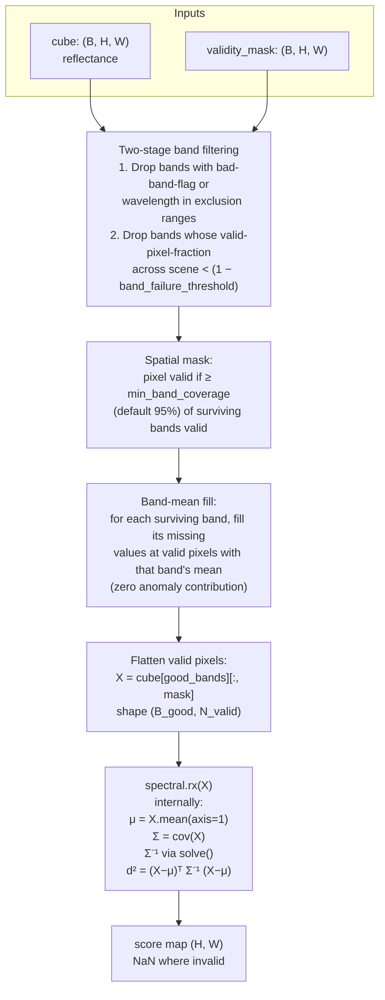

# 07 · Global RX (hyperspectral)

**Sensor:** PRISMA / EnMAP — any hyperspectral cube with B bands of reflectance / radiance.
**Input shape:** `(B, H, W)` numpy array (BSQ), plus optional `(B, H, W)` validity mask.
**Output shape:** `(H, W)` per-pixel anomaly score, NaN where invalid.

## What it solves

Same idea as Doc 06 but with B bands instead of 1. The single z-score generalises to **Mahalanobis distance** in B-dimensional space:

```
RX(x) = (x − μ)ᵀ Σ⁻¹ (x − μ)
```

where:
- `x` is one pixel's spectrum, a vector of length B (e.g. 165).
- `μ` is the mean spectrum over all valid pixels in the scene, also length B.
- `Σ` is the B×B covariance matrix of valid pixels.

The score is high when `x` is "spectrally far" from the scene mean *in a way that respects the band correlations*.

> Analogy: imagine plotting every pixel as a dot in B-dimensional space. The cloud of dots has a **shape** — it might be elongated along one direction (e.g. brightness varies more than colour). Mahalanobis distance asks "how far is this pixel from the centre, measured in units of the cloud's local spread along the direction toward this pixel?" A pixel that's far from the centre but along the same direction the cloud naturally elongates is *not* very anomalous. A pixel that's the same Euclidean distance away but in a perpendicular direction (e.g. wrong colour) **is** very anomalous.

## Algorithm



### Why two stages of band filtering?

| Stage | What it removes | Why |
|---|---|---|
| **1: metadata + wavelength ranges** | Bands flagged invalid by the sensor (cosmic ray hits, dead detectors), and wavelengths in atmospheric-absorption windows (e.g. water vapor at 1380 nm). | These bands are noise. Including them means Σ has a noisy axis that distorts the Mahalanobis geometry. |
| **2: per-band coverage** | Bands where >5 % of the scene's pixels failed validity (configurable via `band_failure_threshold`). | A band that's mostly-invalid in this particular scene won't have a reliable mean / variance estimate. Drop it. |

After both stages you're left with **B_good** bands — typically 150–165 from a 165-band PRISMA cube.

### Spatial mask: coverage-fraction logic

A pixel that's valid in 99 of 165 bands is *partially* observed. The detector keeps such a pixel if at least `min_band_coverage` (default 0.95) of the surviving bands are valid there. Otherwise it's NaN'd out.

### Band-mean fill — why?

Suppose a pixel is valid in 158 of 160 surviving bands. Two bands are missing. The Mahalanobis formula needs a complete vector. Filling the missing entries with the band's mean **adds zero to the score**:

```
(x_b − μ_b)ᵀ Σ⁻¹ … = … with x_b = μ_b → 0 contribution
```

So filled-in entries don't bias the score upward (they look "normal"). They might *slightly* underestimate the true anomalousness because two real values are being replaced by means, but it's a clean, conservative choice.

## Methods and classes used

| Symbol | File | Job |
|---|---|---|
| `GlobalRXDetector` | [app/detectors/global_rx_detector.py](../app/detectors/global_rx_detector.py) | Concrete detector. |
| `GlobalRXResult` | same file | Result dataclass: `rx_score_map`, `spatial_mask`, `good_band_indices`, `n_valid_pixels`, more. |
| `spectral.rx` | external library | Computes Mahalanobis given a `(N, B)` matrix. Handles inverse via `solve()`, with internal regularisation if Σ is near-singular. |
| `AnomalyDetector` (ABC) | [app/abstract_classes/anomaly_detector.py](../app/abstract_classes/anomaly_detector.py) | Base class. |

### Public API

```python
det = GlobalRXDetector(vendable)            # vendable supplies cube, mask, band metadata
det.fit(
    band_failure_threshold=0.05,            # max fraction of pixels a band can fail
    min_band_coverage=0.95,                 # min valid bands per pixel
    exclusion_ranges=DEFAULT_PRISMA_RANGES, # wavelength windows to drop
)
score_map = det.detect(cube, validity_mask)
```

## Numerical stability

The covariance matrix `Σ` is `(B_good × B_good)`. With `B_good = 160` and `N_valid = 1_000_000` pixels, that's a ~26 KB matrix estimated from a million samples — well-conditioned in practice. But:

- **Pixel-to-band ratio** matters. The detector logs this and **warns when N_valid / B_good < 10**. Below that, `Σ` is ill-conditioned and the inverse blows up. Σ effectively has rank only ~N_valid; the missing directions get tiny eigenvalues that explode in `Σ⁻¹`.
- **`spectral.rx` adds a small ridge regulariser** internally (you can tune via library options). Replaces `Σ⁻¹` with `(Σ + λI)⁻¹`.
- **Log-scale eigenvalue ratio** is reported for diagnostics, telling you how flat or peaky the spectral covariance is.

## Configuration knobs

| Knob | Default | Effect |
|---|---|---|
| `band_failure_threshold` | 0.05 | Drop bands with > 5 % failed pixels. Higher = stricter, drops more bands. |
| `min_band_coverage` | 0.95 | Min fraction of surviving bands a pixel must have to be scored. Higher = stricter. |
| `exclusion_ranges` | sensor-specific defaults (atmospheric windows) | Wavelength ranges to always drop. |

## What this detector catches and misses

| Catches | Misses |
|---|---|
| Spectrally rare materials in a homogeneous scene (e.g. a single ship in open water) | Spectrally common materials in unusual configurations (geometry-only anomalies) |
| Materials with unusual band correlations (off-axis from the cloud) | Locally weird, globally common materials |
| Bright outliers on bright bands | Anomalies whose spectral signature happens to align with the cloud's main axis |

When the scene is heterogeneous (multiple land covers), Global RX gets confused — Σ describes the *mixture* of all of them, and any individual class looks moderately weird. That's where **Local RX** (Doc 08) wins.

## Tensor walk-through (concrete example)

For a 1000×1000 PRISMA-derived cube with 165 bands:

| Step | Tensor | Shape | Notes |
|---|---|---|---|
| Input cube | `cube` | `(165, 1000, 1000)` | Reflectance, float32/64 |
| Input validity | `validity_mask` | `(165, 1000, 1000)` | 1/0 binary |
| After Stage 1 band filter | `cube[good_bands]` | `(B_good, 1000, 1000)` | typical `B_good ≈ 158` |
| Spatial mask | `pixel_mask` | `(1000, 1000)` | True where ≥ 95% of `B_good` valid |
| Flatten valid pixels | `X` | `(B_good, N_valid)` | typical `N_valid ≈ 800 000` |
| Mean spectrum | `μ` | `(B_good,)` | One value per band |
| Covariance | `Σ` | `(B_good, B_good)` | ~158×158 |
| Per-pixel score | `d²` | `(N_valid,)` | Chi-squared(B_good) under null |
| Final score map | `score_map` | `(1000, 1000)` | NaN where invalid |

## Result object

`GlobalRXResult` (see source) carries:
- `rx_score_map: (H, W)` — the score map
- `spatial_mask: (H, W) bool` — which pixels were scored
- `good_band_indices: list[int]` — which original bands survived filtering
- `n_valid_pixels: int` — N_valid
- timing, sample-to-band ratio, eigenvalue-ratio diagnostic
- the band-filter parameters used

## Analogies and gotchas

- **Mahalanobis distance is "Euclidean distance after sphering"**. Whitening the data (multiplying by Σ^(−1/2)) makes the cloud look like a sphere; in that whitened space, anomalies are anything far from origin in the usual Euclidean sense. The Mahalanobis formula is exactly the squared Euclidean norm in whitened coordinates.
- **Don't compare scores across scenes.** RX scores are scene-relative. A score of 50 in one scene might be the most anomalous pixel; in another scene 50 might be unremarkable. Always normalise (rank or CDF) before fusing or thresholding across scenes.
- **`spectral.rx` is robust but opaque.** It will return finite values even when Σ is borderline singular. The detector logs N/B and warns you when you're near the cliff. If you see `RX = inf`, you've crossed it.
- **The score follows a chi-squared(B_good) distribution under the Gaussian null.** Mean ≈ B_good, std ≈ sqrt(2 × B_good). With B_good = 160 you should expect "normal" scores around 160. Anomalies are pixels far in the tail (e.g. > 250).
- **Cloud and shadow are anomalies — that's the point and the problem.** Run a cloud mask before running RX, otherwise clouds dominate the top-scoring pixels.
