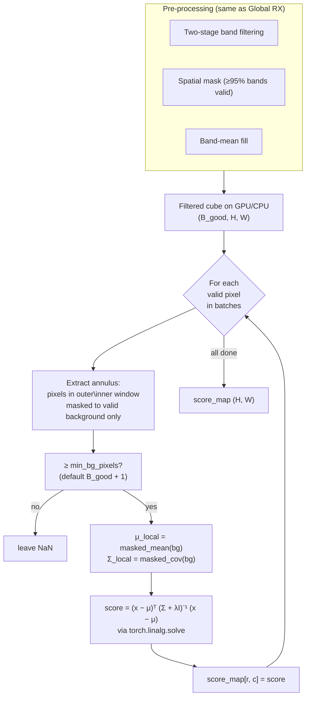

# 08 · Local RX

**Sensor:** PRISMA / EnMAP hyperspectral.
**Input shape:** `(B, H, W)` numpy cube + `(B, H, W)` validity mask.
**Output shape:** `(H, W)` per-pixel anomaly score, NaN where invalid or unscored.

## What it solves

Global RX (Doc 07) computes one mean and one covariance for the whole scene. Local RX computes a **separate mean and covariance for each test pixel**, using only the pixels in a ring around it.

> Analogy: Global RX is "is this person taller than the average person in the entire country?" Local RX is "is this person taller than the average person on their street?". For a tall scientist who has moved into a town of basketball players, Global RX flags them as normal; Local RX correctly flags them as short for the neighbourhood.

This makes Local RX vastly better at finding anomalies in **heterogeneous** scenes — coastlines, rivers, urban / rural transitions — where the global mean and covariance are mixtures that don't describe any one region well.

## The annulus background

For each test pixel `(r, c)` the detector defines two windows centred on the pixel:

- **inner_window** — a square exclusion zone around the pixel (default 5)
- **outer_window** — a larger square (default 25) that includes the inner zone

The "background" is everything inside the **outer** square but outside the **inner** square — an **annulus** of neighbouring pixels.

```
.....................
.....................
....OOOOOOOOOOO......     O = inside outer window
....OOOOOOOOOOO......     I = inside inner window (excluded from background)
....OOOOOIIIOOO......     X = test pixel (centre of inner window)
....OOOOOIXIOOO......     B = background pixels = O minus I
....OOOOOIIIOOO......
....OOOOOOOOOOO......
....OOOOOOOOOOO......
.....................
```

Why exclude the inner window?

- The test pixel itself shouldn't enter its own background — that would lower its score.
- The detector also wants to leave a **guard zone** around the pixel so that an extended anomaly (e.g. a 3-pixel-wide gas plume) doesn't contaminate the background statistics it's being compared against.

## Algorithm



`λI` regularisation (default `λ = 1e-4`) prevents `Σ_local` from becoming singular when the annulus is small or homogeneous.

### Why batched?

A 1000×1000 scene has up to a million test pixels. Each one needs:

- An extraction (256-pixel annulus)
- A masked mean (over up to 256 spectra)
- A masked covariance (B_good × B_good)
- A 160×160 linear solve

Doing this per-pixel in pure Python is glacially slow. The detector batches `batch_size` test pixels at a time and runs all the linear algebra as **batched torch ops** on the best available device (CUDA > MPS > CPU). Hardware autodetection logic in the file picks the device and tunes `batch_size` to fit ~25 % of GPU VRAM.

## Methods and classes used

| Symbol | File | Job |
|---|---|---|
| `LocalRXDetector` | [app/detectors/local_rx_detector.py](../app/detectors/local_rx_detector.py) | Concrete detector. |
| `LocalRXResult` | same file | Result object: `lrx_score_map`, `spatial_mask`, `computed_mask`, window sizes, etc. |
| Inherits band filtering | from `GlobalRXDetector` | Same two-stage logic + spatial coverage mask. |
| `torch.linalg.solve` | torch | Solves `Σ x = (x − μ)` per-batch in a numerically stable way (preferred over computing `Σ⁻¹` explicitly). |

### Public API

```python
det = LocalRXDetector(vendable)
det.fit(
    outer_window=25,         # outer half-side of the annulus, in pixels
    inner_window=5,          # inner exclusion (guard) half-side
    regularization=1e-4,     # diagonal ridge added to Σ_local
    min_bg_pixels=None,      # default = B_good + 1 (min for invertible Σ)
    stride=1,                # >1 to subsample test pixels
    batch_size=None,         # auto-tuned by device VRAM
    band_failure_threshold=0.05,
    min_band_coverage=0.95,
    exclusion_ranges=...,
)
score_map = det.detect(cube, validity_mask)
```

## Tensor shape walk-through

For a 1000×1000 cube with 165 bands, B_good = 158, outer = 25, inner = 5:

| Tensor | Shape | Notes |
|---|---|---|
| Input cube | `(165, 1000, 1000)` | |
| After band filter | `(158, 1000, 1000)` | |
| Padded backgrounds (per batch) | `(batch_size, max_bg, 158)` | `max_bg = (2·25+1)² − (2·5+1)² = 2601 − 121 = 2480` worst-case neighbours |
| Background validity mask | `(batch_size, max_bg)` | true where the slot has a real background pixel |
| `μ_local` | `(batch_size, 158)` | masked mean across slots |
| `Σ_local` | `(batch_size, 158, 158)` | masked covariance |
| Test-pixel residual | `(batch_size, 158)` | `x − μ_local` |
| Solve | `Σ x_solve = residual` | yields `(batch_size, 158)` |
| Score | `(batch_size,)` | `residual · x_solve` summed across band axis |

The padding to `max_bg` lets the algorithm vectorise across batch entries even when the actual number of background pixels varies (because some annuli straddle invalid regions). The mask handles the slack.

## Stride > 1 — fast mode

For very large scenes, scoring every pixel is overkill. `stride=2` halves H *and* W (4× fewer test pixels). The detector then **bilinearly interpolates** the sparse score map back to full resolution.

| stride | Pixels scored | Speedup | Score quality |
|---:|---:|---:|---|
| 1 | 100 % | 1× | Exact |
| 2 | 25 % | ~4× | Slight smoothing — anomalies wider than 1 pixel still found, point sources may be diluted |
| 4 | 6.25 % | ~16× | Good for scoping, miss point sources |

NaN handling during interpolation uses a weighted blend so unscored pixels (e.g. inside invalid swaths) don't pull values from outside.

## Configuration knobs

| Knob | Default | Effect |
|---|---|---:|
| `outer_window` | 25 | Annulus outer radius in pixels. Larger = more background = smoother estimate but slower. |
| `inner_window` | 5 | Guard zone radius. Should be larger than the expected anomaly size. |
| `regularization` | 1e-4 | Ridge added to `Σ_local`. Higher = more stability, less sensitivity. |
| `min_bg_pixels` | `B_good + 1` | Below this, the local Σ is rank-deficient → leave NaN. |
| `stride` | 1 | Subsample stride; bilinear-interp back to full res when > 1. |
| `batch_size` | auto | Per-batch number of test pixels. Auto-picked from device VRAM. |
| `band_failure_threshold`, `min_band_coverage`, `exclusion_ranges` | same as Global RX | Pre-filter bands and pixels. |

## Performance notes

- **CUDA preferred.** With 1000×1000 × 165 bands, `outer=25`, `inner=5`, the detector typically runs in ~10–60 s on a modern GPU and 5–30 minutes on CPU.
- **Memory peak** is `batch_size · max_bg · B_good · 4 bytes` for backgrounds plus `batch_size · B_good²` for Σ. The auto-tuning aims for 25 % VRAM headroom.
- **MPS (Apple Silicon)** works but the linalg ops fall back to CPU for some operations; expect 2–5× slower than CUDA.

## Analogies and gotchas

- **Local RX is essentially "RX with a moving window".** Same Mahalanobis math, different μ and Σ for every pixel.
- **The annulus is doing two jobs at once: spatial locality and target exclusion.** Pick `inner_window` based on the *largest anomaly size you care about*. If you expect 7×7 wildfire blobs, use `inner_window ≥ 4` so the centre of an anomaly doesn't see its own edges.
- **Smaller `outer_window` is *not* always better.** You need at least `B_good + 1` background samples for `Σ_local` to be invertible. With `B_good = 158` and `outer = 5, inner = 1`, the annulus has only `121 − 9 = 112` slots — Σ is rank-deficient and you'll get NaN. Pick `outer` so `(2·outer+1)² − (2·inner+1)² ≥ 2·B_good`.
- **Edge effects.** Pixels near the scene boundary have a partial annulus. The detector pads with the validity mask so background samples outside the cube are simply absent — the masked covariance handles this. But if the available count drops below `min_bg_pixels`, the pixel is left NaN.
- **Don't compare LRX scores across pixels with different background counts.** A pixel scored against 200 backgrounds and one scored against 2000 backgrounds have different effective degrees of freedom. The CDF normalisation in the Statistical Ensembler (Doc 10) handles this if it matters.
- **Try Local RX before reaching for the ML models.** A well-tuned Local RX is often competitive with neural-net reconstruction for "find-the-needle" tasks, runs in seconds, and needs zero training data.
