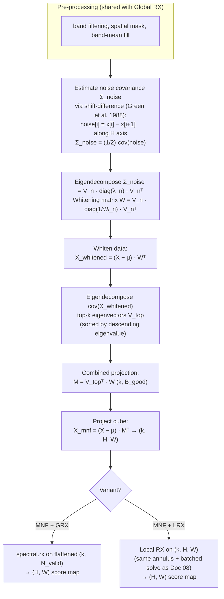

# 09 · MNF + RX (Global and Local variants)

**Sensor:** PRISMA / EnMAP hyperspectral.
**Input shape:** `(B, H, W)` numpy cube + `(B, H, W)` validity.
**Output shape:** `(H, W)` per-pixel anomaly score.
**Two variants in this doc:**
- `MNFCompressionDetector` — MNF compression + Global RX
- `MNFCompressionLRXDetector` — MNF compression + Local RX

## What this adds on top of plain RX

Global / Local RX work in the original B-band space. With B = 165, those are very-high-dimensional Mahalanobis distances. Many of those bands are correlated, redundant, or outright noisy. The covariance `Σ` has lots of small "noise" eigenvalues that, when inverted, blow up small noise differences into apparent anomalies.

**MNF (Minimum Noise Fraction) compression** denoises the cube and reduces dimensionality before scoring. Steps:

1. Estimate the **noise covariance** `Σ_noise` from spatial differences in the cube.
2. **Whiten** by `Σ_noise^(−1/2)`. Now noise has unit covariance and the leading axes of variation are signal.
3. Eigendecompose the **whitened data covariance**. Eigenvectors with the largest eigenvalues are the high-SNR directions.
4. Project the cube onto the top-k eigenvectors → `(k, H, W)`. Default `k = 10`.

Then run RX on this `(k, H, W)` cube. Both Global and Local versions exist.

> Analogy: imagine a foggy photograph. PCA gives you the dominant directions of pixel variance, but if the fog is uniform, half those directions might be "fog" axes. MNF tilts the analysis so it cares about variance *relative to noise*. After projecting onto the top-k MNF components, the fog is gone (or down-weighted) and the structure is in the leading axes. Run RX in that cleaner space.

## Algorithm



### The shift-difference noise estimate

Why use horizontal shift differences as an estimate of noise? Because adjacent pixels in a smooth scene should have **almost identical** spectra, so any difference between them is dominated by per-pixel noise. Take many such differences across the scene and you get a good estimate of the noise covariance with zero training data.

```
noise[h, w] = X[h, w] − X[h, w+1]
Σ_noise ≈ (1/2) · cov(noise vectors)
```

The `1/2` factor accounts for the fact that the difference combines noise from two pixels.

### Why two eigendecompositions?

Single PCA: project onto the directions of *largest data variance*. That's PCA. Problem: those directions are dominated by signal *and* noise.

MNF: first whiten by noise, then PCA in the whitened space. After whitening, noise has unit covariance and is direction-agnostic. Variance in the whitened space = signal-to-noise ratio. Top-k eigenvectors are the directions with the **highest SNR**, not just the highest variance.

## Tensor shapes

For a 1000×1000 PRISMA-derived cube, B = 165, B_good = 158, k = 10:

| Tensor | Shape |
|---|---|
| `cube` | `(165, 1000, 1000)` |
| After band filter | `(158, 1000, 1000)` |
| `Σ_noise` | `(158, 158)` |
| Whitening matrix `W` | `(158, 158)` |
| Whitened-cov eigenvectors `V_top` | `(10, 158)` |
| Combined projection `M` | `(10, 158)` |
| `X_mnf` | `(10, 1000, 1000)` |
| **MNF + Global RX** score map | `(1000, 1000)` |
| **MNF + Local RX** score map | `(1000, 1000)` |

## Methods and classes used

| Symbol | File | Job |
|---|---|---|
| `MNFCompressionDetector` | [app/detectors/mnf_compression_detector.py](../app/detectors/mnf_compression_detector.py) | MNF + Global RX. |
| `MNFCompressionLRXDetector` | [app/detectors/mnf_compression_lrx_detector.py](../app/detectors/mnf_compression_lrx_detector.py) | MNF + Local RX. |
| `MNFCompressionRXResult`, `MNFCompressionLRXResult` | same files | Result dataclasses with `mnf_eigenvalues`, score map, masks, etc. |
| `spectral.rx` | external | Global RX on the compressed cube. |
| `torch.linalg.solve` | torch | Per-pixel local Mahalanobis (LRX variant). |
| Inherits band filter / spatial mask from `GlobalRXDetector` | [app/detectors/global_rx_detector.py](../app/detectors/global_rx_detector.py) | |

### Public APIs

```python
# MNF + Global RX
det = MNFCompressionDetector(vendable)
det.fit(n_components=10, band_failure_threshold=0.05, min_band_coverage=0.95)
score = det.detect(cube, validity_mask)

# MNF + Local RX
det = MNFCompressionLRXDetector(vendable)
det.fit(n_components=10, outer_window=25, inner_window=5,
        regularization=1e-4, stride=1, batch_size=None)
score = det.detect(cube, validity_mask)
```

## Why MNF helps both Global and Local RX

| Effect | MNF + GRX | MNF + LRX |
|---|---|---|
| Reduces dimensionality from B_good (~158) to k (~10) | huge — Σ shrinks 158×158 → 10×10 | Σ_local shrinks similarly per-pixel |
| Suppresses high-noise directions before scoring | stops noise from inflating Σ⁻¹ | per-pixel Σ_local is more stable, fewer pixels left NaN due to rank deficiency |
| Faster | Σ⁻¹ on 10×10 is ~250× cheaper than 158×158 | Per-pixel solve is dramatically cheaper, allows larger batches on GPU |
| Slightly less sensitive | might miss anomalies whose signature lies in the discarded low-SNR directions | same caveat |

The compression is lossy. If the anomaly you're hunting is *only* visible in a single noisy band (rare in practice), MNF will throw it away.

## Configuration knobs

Common to both:

| Knob | Default | Effect |
|---|---|---|
| `n_components` (k) | 10 | Number of MNF axes kept. Larger = less compression, more sensitivity, slower. |
| `band_failure_threshold` | 0.05 | Pre-MNF band filter, same as plain RX. |
| `min_band_coverage` | 0.95 | Pre-MNF spatial filter. |

Local-RX-specific (extra):

| Knob | Default | Effect |
|---|---|---|
| `outer_window` | 25 | Same as Doc 08, but the annulus collects vectors in MNF space (length k). |
| `inner_window` | 5 | Same. |
| `regularization` | 1e-4 | Ridge for Σ_local. |
| `min_bg_pixels` | `k + 1` | Lower than plain LRX because k is small. |
| `stride` | 1 | Bilinear-interp back to full res when > 1. |
| `batch_size` | auto | VRAM-tuned. |

## Numerical stability tricks

- **Clamp small noise eigenvalues to 1e-10** before whitening — otherwise `1/√λ_n` for tiny λ blows up and amplifies numerical noise.
- **Log the leading-to-trailing eigenvalue ratio** of the retained k components — diagnoses how much information is left in the top-k subspace. A flat eigenvalue distribution means MNF didn't compress much.
- **For LRX, `min_bg_pixels = k + 1`** is much smaller than `B_good + 1`, so far fewer pixels are left NaN due to rank deficiency. This is one of MNF-LRX's biggest practical wins.

## Analogies and gotchas

- **MNF is "PCA done right for spectral data".** Plain PCA picks high-variance axes; MNF picks high-SNR axes. Because hyperspectral noise is roughly uncorrelated band-to-band but signal is strongly correlated, the two often disagree.
- **k = 10 is conventional, not magic.** Many papers use 10–20. If you set k too small you collapse signal into noise. Too large and you lose the denoising benefit. Inspect `mnf_eigenvalues` after fitting; a sharp elbow tells you a natural cut.
- **The shift-difference noise model assumes the scene is *spatially smooth*.** Crisp edges (coastlines, urban blocks) inflate the noise estimate. In practice this just makes MNF slightly conservative — it picks fewer "signal" directions than it could — but it's still better than not whitening.
- **Run a cloud mask first.** MNF based on a cloudy scene attributes much of its top-k variance to clouds. The principal components become "cloud detectors", and your anomaly map will mostly highlight cloud edges.
- **MNF + LRX is the workhorse hyperspectral detector**. Compared to plain LRX, it's faster, has fewer rank-deficiency drop-outs, and is roughly as sensitive. It's what the Statistical Ensembler (Doc 10) uses behind the scenes when destriping is on.
