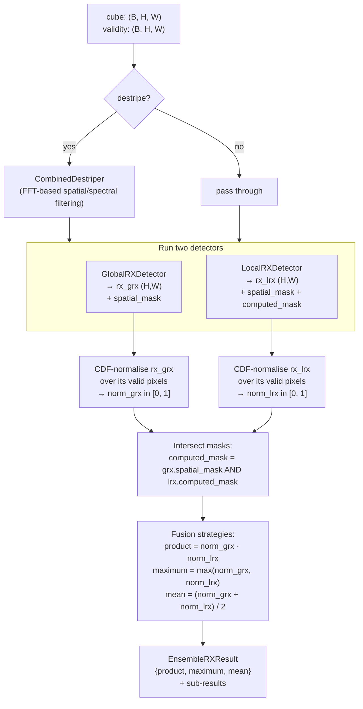

# 10 · Statistical Ensembler

**Sensor:** PRISMA / EnMAP hyperspectral.
**Input shape:** `(B, H, W)` cube + `(B, H, W)` validity.
**Output shape:** `(H, W)` fused anomaly score in [0, 1].

## What it solves

Global RX (Doc 07) and Local RX (Doc 08) catch different things:

- **Global** is good at *spectrally rare* materials in fairly uniform scenes.
- **Local** is good at *locally weird* pixels in heterogeneous scenes.

Neither alone is the right answer. The Statistical Ensembler runs both, normalises their score maps onto a common scale (rank in [0, 1]), and **fuses them** into a single map via product, max, or mean. Optionally, it destripes the cube first to reduce sensor-induced striping artefacts that would otherwise dominate both detectors.

> Analogy: two doctors examining a patient with different specialities. One sees the whole body (Global RX), the other examines specific neighbourhoods (Local RX). For each doctor's verdict, you ask "where does this patient rank among the doctor's other patients?" — that's the CDF normalisation. Then you fuse: a patient flagged as suspicious by *both* doctors (product) is the most worrying; a patient flagged by *either* (max) is worth investigating; the mean is a balanced view.

## Pipeline



## Why CDF normalisation?

Global and Local RX scores live on **different scales**:

- Global RX: chi-squared(B_good), mean ≈ 158, std ≈ 17. Anomalies might be in the hundreds.
- Local RX: each pixel uses a *different* `Σ_local`, so even within one map the score scale drifts.

Adding two scores together when one routinely outweighs the other by 10× makes the smaller one irrelevant. Solution: rank-transform each map.

```
norm(p) = rank(score(p)) / (N_valid + 1)       in [0, 1]
```

The most anomalous pixel in each map gets ~1.0. The least anomalous gets ~0. Now the two maps are directly comparable.

> Analogy: this is the same as converting raw test scores into percentiles. A 95th percentile in math and a 95th percentile in English both mean "near the top of the cohort", regardless of how the raw scores were scaled.

## Three fusion strategies

| Strategy | Formula | Behaviour | When to prefer |
|---|---|---|---|
| `product` | `norm_grx · norm_lrx` | Conservative. A pixel scores high only if **both** detectors flag it. | High-precision needs; few false positives. Default. |
| `maximum` | `max(norm_grx, norm_lrx)` | Permissive. A pixel scores high if **either** detector flags it. | Recall-first: don't miss anything. |
| `mean` | `(norm_grx + norm_lrx) / 2` | Balanced. Both detectors contribute equally. | When you want smooth combined ranking. |

The result object stores **all three**; the caller picks which one to threshold.

### Edge cases

- A pixel scored by Global RX but **not** by Local RX (e.g. dropped due to rank-deficient Σ_local) is excluded from the fused map. The intersection logic ensures fusion only happens where both detectors produced a score.
- If `destripe=True`, the GRX and LRX run on the destriped cube but their results are returned aligned to the original spatial grid.

## Methods and classes used

| Symbol | File | Job |
|---|---|---|
| `StatisticalEnsembler` | [app/detectors/statistical_ensembler.py](../app/detectors/statistical_ensembler.py) | The detector. |
| `EnsembleRXResult` | same file | Result dataclass: `grx_result`, `lrx_result`, `normalized_grx_map`, `normalized_lrx_map`, `fused_score_maps` (dict). |
| `GlobalRXDetector`, `LocalRXDetector` | (Docs 07, 08) | Sub-detectors. |
| `CombinedDestriper` | (separate utility) | FFT-based stripe-removal applied before the detectors when `destripe=True`. |

### Public API

```python
ens = StatisticalEnsembler(vendable)
ens.fit(
    band_failure_threshold=0.05,
    min_band_coverage=0.95,
    outer_window=25, inner_window=5,
    default_strategy="product",
    destripe=True, fft_kwargs={...},
)
score_map = ens.detect(cube, validity_mask)   # returns the default_strategy map

# Or fetch all three maps:
result = ens.run(cube, validity_mask)
print(result.fused_score_maps.keys())  # {'product', 'maximum', 'mean'}
```

## Tensor shape walk-through

For a 1000×1000 PRISMA cube, B=165, B_good=158:

| Step | Tensor | Shape |
|---|---|---|
| Input cube + validity | `(165, 1000, 1000)` × 2 | |
| (optional) Destripe | `(165, 1000, 1000)` | |
| GRX detect | `rx_grx` | `(1000, 1000)` |
| GRX mask | `spatial_mask_grx` | `(1000, 1000)` bool |
| LRX detect | `rx_lrx` | `(1000, 1000)` |
| LRX masks | `spatial_mask_lrx`, `computed_mask` | `(1000, 1000)` bool ×2 |
| CDF-normalise GRX | `norm_grx` | `(1000, 1000)` ∈ [0, 1] |
| CDF-normalise LRX | `norm_lrx` | `(1000, 1000)` ∈ [0, 1] |
| Intersected mask | `(1000, 1000)` bool | |
| Each fused map | `(1000, 1000)` ∈ [0, 1] | |

## Configuration knobs

| Knob | Default | Effect |
|---|---|---|
| `destripe` | True | Run `CombinedDestriper` first. |
| `fft_kwargs` | sensor-specific | Forwarded to the destriper. |
| `default_strategy` | `"product"` | Which fused map `detect()` returns. |
| All Global RX knobs | (see Doc 07) | Forwarded to the GRX sub-detector. |
| All Local RX knobs | (see Doc 08) | Forwarded to the LRX sub-detector. |

## Why destripe?

Push-broom hyperspectral sensors (PRISMA, EnMAP) often produce **across-track stripes** — small per-detector calibration offsets that show up as faint vertical or horizontal banding in the scene. Both Global and Local RX are sensitive to this banding because it's a real spectral signal that doesn't match the scene mean. Without destriping, the top-scoring pixels are often along sensor stripes, not real anomalies.

`CombinedDestriper` applies FFT-based filtering in the spatial-frequency domain to suppress the periodic stripe component. After destriping, the two RX detectors see a cleaner cube and their scores are dominated by genuine surface anomalies.

## Analogies and gotchas

- **Rank normalisation is monotone.** It preserves ordering within each map (the top-1 pixel in the raw map is still the top-1 after normalisation) but it **collapses all anomalies to the top of the cohort**. If your cohort is huge and clean, the most-anomalous pixel still gets a CDF of ~1.0. CDF tells you "where in the rank does this pixel sit", not "how many σ".
- **Product fusion is multiplicative.** A pixel that's 0.99 in GRX and 0.01 in LRX gets a product of 0.0099 — basically zero. That's the conservative behaviour you want for precision: both detectors must agree.
- **Mean fusion is sensitive to scale of disagreement.** A pixel that's 0.99 in GRX and 0.01 in LRX gets mean = 0.5, which is "moderately anomalous". Sometimes that's right (one detector found it, the other didn't), sometimes you want product's "no, must be flagged by both" behaviour.
- **The intersection of masks can be small.** If LRX leaves many pixels unscored (rank-deficient annuli), the fused map is sparse. Use MNF + LRX (Doc 09) instead of plain LRX inside the ensembler when this is a problem.
- **Don't mix-and-match thresholds across scenes.** Even after CDF normalisation, what counts as "anomalous" depends on how many true anomalies are in the scene. A clean scene will have CDF-1.0 pixels that are noise; a dirty scene will have lots of CDF > 0.9 pixels that are real. Calibrate per-scene or per-region.
- **The default strategy is `product` for a reason.** In production workflows where false alarms are expensive (operator time, downstream review), product is the right default. Switch to `maximum` for recall-first triage and `mean` for offline ranking.
