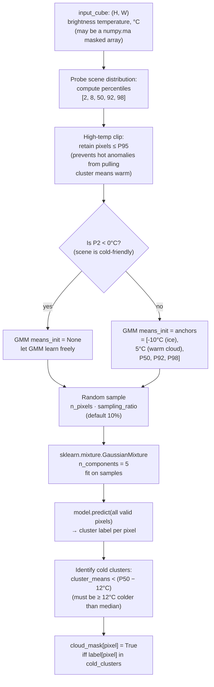

# 11 · B10 Adaptive Cloud Masker

**Sensor:** Landsat 9 B10 thermal (single-band brightness temperature in °C).
**Input shape:** `(H, W)` 2-D array of brightness temperature.
**Output shape:** `(H, W)` boolean array — `True = cloud`.

## What it solves

Clouds in a thermal scene are **much colder** than the ground beneath them, because the upper atmosphere is colder than the surface. So you'd think: just threshold below some fixed temperature. But:

- Some clouds are warm (low altitude, summer, tropics) — fixed threshold misses them.
- Some land is cold (winter, ice, high altitudes) — fixed threshold flags it as cloud.

The adaptive masker fits a **5-component Gaussian Mixture Model (GMM)** to the scene's temperature histogram and labels the cold clusters as cloud. The threshold becomes scene-dependent.

> Analogy: instead of fixed cutoffs ("anyone below 10 °C is sick"), look at this room's temperature distribution. If most people are around 36 °C and a sub-cluster sits around 32 °C, that sub-cluster is anomalously cold *for this room*, regardless of the absolute number.

## Algorithm



### Why these specific anchor temperatures?

When the scene's coldest pixels are above 0 °C, the GMM, left to its own devices, will place all five components in the warm regime — there's nothing cold for it to fit. To make sure the GMM is *capable* of finding cold clouds, the masker forces two components onto cold anchors:

- **−10 °C** — typical of ice, snow, or high-altitude cloud tops.
- **5 °C** — typical of warm low-altitude clouds.

Plus three at the scene's own percentiles (median, 92nd, 98th) for the warm bulk. The GMM still moves them during fitting, but the initialisation guarantees they survive in the right neighbourhood.

In a *cold-friendly* scene (P2 < 0 °C, e.g. a winter scene), the natural data distribution already has cold pixels, so no anchoring is needed.

### Why high-temp clipping during training?

If you trained the GMM on the full distribution including the hottest pixels (which might be wildfire / industrial anomalies), one of the five components would slide warm to fit them. That's the wrong outcome — anomalies shouldn't anchor a cluster. Clipping at the 95th percentile during fitting keeps cluster means representative of the bulk distribution.

### Why "≥ 12 °C colder than median" for the cloud rule?

The 12 °C constant is chosen to be **safely beyond per-class natural variation**. Land cover varies by ~5–10 °C even within one scene (vegetation vs bare soil vs water). Beyond ~12 °C below the scene median, you're outside that natural range and into the cloud regime.

## Methods and classes used

| Symbol | File | Job |
|---|---|---|
| `B10AdaptiveCloudMasker` | [app/statistical_models/b10_adaptive_cloud_masker.py](../app/statistical_models/b10_adaptive_cloud_masker.py) | The masker. |
| `AdaptiveCloudMaskerResponse` | same file | Result: `cloud_mask`, `n_comp`, `model`, `anchors`. |
| `sklearn.mixture.GaussianMixture` | sklearn | The 5-component GMM. |
| `numpy.ma` masked arrays | numpy | Input convention for invalid-pixel handling. |

### Public API

```python
masker = B10AdaptiveCloudMasker()
masker.configure(
    sampling_ratio=0.1,                          # 10% sample for GMM fit
    physical_cloud_threshold_in_celsius=30,      # cap on warm-cloud anchor (informational)
    significant_cloud_potential_in_celsius=0,    # P2 cutoff for cold-friendly mode
)
masker.train(input_cube)            # fits GMM
result = masker.predict(input_cube) # returns AdaptiveCloudMaskerResponse
mask = result.cloud_mask            # (H, W) bool, True = cloud
```

## Tensor shapes

| Step | Tensor | Shape |
|---|---|---|
| Input | `cube` | `(H, W)` (or masked) |
| Valid pixels | `valid_pixels` | `(N_valid,)` 1-D |
| Sample for fit | `sample` | `(N_valid · 0.1,)` |
| Anchors | `anchors` | `(5,)` (or `None` if free-fit) |
| GMM fit | `model.means_` | `(5, 1)` |
| Predict on valid | `labels` | `(N_valid,)` |
| Cluster means | `means` | `(5,)` |
| Cold cluster set | `cold_idx` | small subset of `{0..4}` |
| Output mask | `cloud_mask` | `(H, W)` bool |

## Why a *Gaussian Mixture* and not k-means?

K-means assigns each pixel to its nearest cluster centre — hard, equal-weight clusters. GMM assigns *probabilities* and lets each component have its own variance:

- A wide cluster (heterogeneous land cover) can absorb a broad temperature range.
- A narrow cluster (cold cloud at uniform altitude) stays narrow.
- Hard cluster boundaries from k-means would over-segment heterogeneous land.

GMM also gives you posterior probabilities — useful if you want soft cloud confidence instead of binary masks. The masker takes the hard prediction (`predict`), but the underlying model also exposes `predict_proba`.

## Configuration knobs

| Knob | Default | Effect |
|---|---|---|
| `sampling_ratio` | 0.1 | Fraction of valid pixels used for GMM fit. Smaller = faster, noisier fit. |
| `physical_cloud_threshold_in_celsius` | 30 | Sanity cap on warm-cluster anchor. |
| `significant_cloud_potential_in_celsius` | 0 | P2 threshold below which cold-anchor mode is skipped. |
| `expansive_percentiles` | [2, 8, 50, 92, 98] | Used to characterise the scene. |
| `restrictive_percentiles` | [2, 8, 50] | Used inside the cold-cluster decision. |
| Number of components | 5 (3 in cold-friendly mode) | Hard-coded. |

## How this is used in the pipeline

The cloud mask is multiplied into the **validity mask** for every downstream consumer:

```python
validity = pure_validity * predicted_cloud_mask    # element-wise AND
```

That's how every thermal trainer and inferencer in this repo (Docs 01–04) gets its "valid AND clear" pixels. The shard format includes a `predicted_cloud_mask.npy` field per-patch so this is pre-computed at patch-generation time, not at training time.

## Analogies and gotchas

- **GMM is "probabilistic k-means with shape".** Each component has a mean *and a variance*; cluster boundaries follow level sets of probability density rather than Voronoi cells.
- **The masker assumes B10 is brightness temperature in °C.** Don't feed it Kelvin or DN. Convert first via `ST(K) = 0.00341802·DN + 149.0` then K → °C.
- **Hot anomalies aren't clouds, but they look weird.** The 95th-percentile clip during fitting prevents wildfire pixels from contaminating the GMM. If you skip that clip, the masker can mis-fit and accidentally label warm pixels as a "cluster" that isn't cold and isn't normal.
- **5 is a lot of components for a 1-D problem.** Not really — a typical thermal scene has water (cool), vegetation (warm), bare soil (warmer), urban (warmest), and possibly cloud (very cold). Five is a reasonable accommodation for that.
- **The cold-cluster threshold (P50 − 12 °C) can be tuned.** In tropical scenes where land is uniformly warm, 12 °C might be too lax. In high-latitude winter scenes, it might be too strict. Tuning lives in the source — there's no config knob for it currently.
- **This is a *statistical* model, not an ML model.** It is **trained per scene** (fits the GMM to each new scene) — not pre-trained on a dataset. There is no `.pt` checkpoint for it. Hence its placement under `app/statistical_models/` rather than `app/foundation_models/`.
- **Edge case: a scene with no clouds.** All 5 cluster means will be above the cold threshold, so `cold_idx` is empty, and the cloud mask is all-False. Correct behaviour.
- **Edge case: a scene that is mostly cloud.** The "median" is now driven by cloud pixels, the cold-cluster threshold becomes very cold, and you end up flagging only the very coldest pixels (cloud cores) — under-detecting. This is a known limitation; in heavy-cloud scenes, supplement with a provider QA mask.
