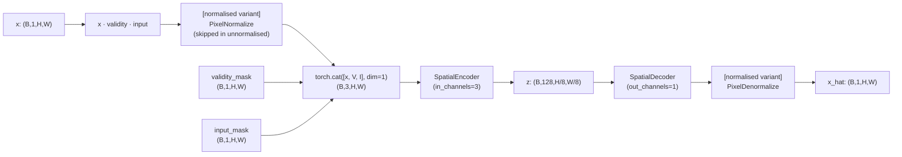
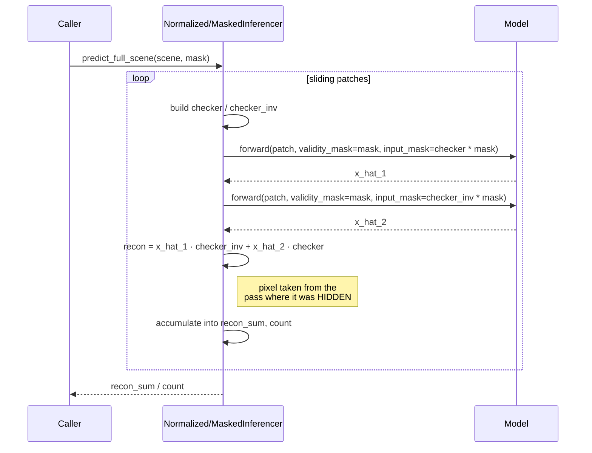
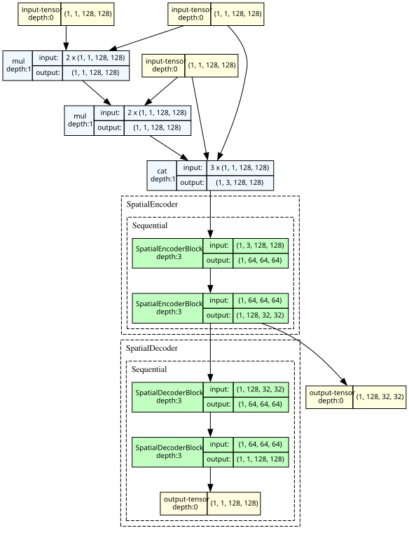

# 03 · Normalized & Unnormalized Masked Autoencoders (thermal)

**Sensor:** Landsat 9 B10 thermal
**Input shape:** `(B, 1, H, W)` thermal + two `(B, 1, H, W)` masks
**Output shape:** `(B, 1, H, W)` reconstruction
**Two variants in this doc:**
- `NormalizedMaskedSpatialAutoencoder` — z-score normalisation + masked recon
- `UnNormalizedSpatialAutoencoder` — same idea, no normalisation

## What changes vs Doc 02

In Doc 02 the mask was applied *implicitly* (hidden pixels were zeroed before the forward pass; the model had to infer "this is hidden" from the zero). In **this** family the masks are passed in as **explicit channels concatenated to the input**. The encoder receives 3 channels:

| Channel | Meaning | Domain |
|---|---|---|
| 0 | Pixel value (zeroed where hidden) | °C (or z-score, in normalised variant) |
| 1 | `validity_mask` — 1 where the pixel is physically real | {0, 1} |
| 2 | `input_mask` — 1 where the pixel is visible to the encoder | {0, 1} |

The network can now disambiguate "this pixel is invalid (e.g. cloud)" from "this pixel was deliberately hidden for the prediction task". That distinction matters: a cloud pixel has no usable signal in any pass, whereas a deliberately hidden pixel was valid and is the actual prediction target.



## Why bother — what does the explicit mask buy you?

Three things:

1. **The encoder can react to the mask immediately.** With implicit masking, "zero" means "hidden OR invalid OR genuinely zero temperature". The encoder has to disentangle that. With explicit masking it can read the validity bit directly.
2. **Better behaviour at boundary regions.** Patches with fragmented validity (cloud + scene edge) confuse implicit-mask models. Explicit masks let the model down-weight unreliable regions cleanly.
3. **The decoder gets a unified out-channel count.** The decoder always outputs 1 channel (temperature), regardless of whether the input had 3 channels (image + 2 masks).

## Tensor walk-through

For `base_channels=32, num_stages=3` on a 128×128 patch:

| Tensor | Shape | Notes |
|---|---|---|
| `pixels` | `(B, 1, 128, 128)` | Raw °C |
| `validity_mask` | `(B, 1, 128, 128)` | physical validity |
| `input_mask` | `(B, 1, 128, 128)` | which pixels the model can see this pass |
| `x · validity · input` | `(B, 1, 128, 128)` | hidden / invalid pixels are zeroed |
| (normalised) `PixelNormalize` | `(B, 1, 128, 128)` | z-score |
| `concat([x, validity, input], dim=1)` | `(B, 3, 128, 128)` | encoder input |
| Encoder stage 0 | `(B, 32, 64, 64)` | |
| Encoder stage 1 | `(B, 64, 32, 32)` | |
| Encoder stage 2 (`z`) | `(B, 128, 16, 16)` | bottleneck |
| Decoder stage 0–2 | mirrors back to `(B, 1, 128, 128)` | |
| (normalised) `PixelDenormalize` | `(B, 1, 128, 128)` | back to °C |

## Methods and classes used

| Symbol | File | Job |
|---|---|---|
| `NormalizedMaskedSpatialAutoencoder` | [components/normalized_masked_spatial_auto_encoder.py](../app/foundation_models/components/normalized_masked_spatial_auto_encoder.py) | 3-channel input, normalised pixels, denormalised output. |
| `UnNormalizedSpatialAutoencoder` | [components/unnormalized_spatial_auto_encoder.py](../app/foundation_models/components/unnormalized_spatial_auto_encoder.py) | Identical idea, no PixelNormalize/Denormalize. |
| `SpatialEncoder` / `SpatialDecoder` | (same as Doc 01) | Re-used; just constructed with `in_channels=3`, `out_channels=1`. |
| `NormalizedMaskedAutoencoderTrainer` | [trainers/normalized_masked_autoencoder_trainer.py](../app/foundation_models/trainers/normalized_masked_autoencoder_trainer.py) | Trainer for the normalised variant. |
| `UnNormalizedSpatialMaskedAutoencoderTrainerL1Loss` | [trainers/spatial_masked_autoencoder_trainer_l1_loss_unnormalized.py](../app/foundation_models/trainers/spatial_masked_autoencoder_trainer_l1_loss_unnormalized.py) | Trainer for the unnormalised variant. |
| `NormalizedMaskedAutoencoderInferencer` | [inferencers/normalized_masked_autoencoder_inferencer.py](../app/foundation_models/inferencers/normalized_masked_autoencoder_inferencer.py) | Two-pass checkerboard with explicit `validity_mask` + `input_mask` arguments. |
| `MaskedSpatialAutoencoderInferencer` | [inferencers/masked_spatial_autoencoder_inferencer.py](../app/foundation_models/inferencers/masked_spatial_autoencoder_inferencer.py) | Same logic for the unnormalised variant. |

## Training

```mermaid
sequenceDiagram
    participant Loop as FoundationTrainer.train()
    participant T as Normalized/UnNormalizedTrainer
    participant M as (Un)NormalizedMaskedAutoencoder
    participant Opt as Adam

    Loop->>T: compute_loss(batch)
    T->>T: validity = pure_validity * predicted_cloud_mask
    T->>T: drop patches with <40% valid
    T->>T: ratio = U(min_masking, max_masking) per sample
    T->>T: prediction_mask = (rand < ratio) & (validity==1)
    T->>T: input_mask = validity − prediction_mask
    T->>M: forward(pixels, validity_mask, input_mask)
    Note over M: x = x * validity * input<br/>then concat with masks
    M-->>T: x_hat
    T->>T: loss = (|x_hat − x| · prediction_mask).sum() / prediction_mask.sum()
    T->>Opt: backward + step
```

### Loss

```
L = Σ |x_hat − x| · prediction_mask
    ───────────────────────────────
        Σ prediction_mask
```

L1 loss on prediction targets only — same as Doc 02's L1 variant. Unnormalised model operates in raw °C; normalised operates in z-score and the loss is implicitly in normalised units (because `x_hat` is denormalised before comparison).

### Validation

`compute_validation_loss()`: runs with `validity_mask = mask, input_mask = mask` (no prediction blanking) and reports L1 error on **all valid pixels**. Stable, comparable across epochs.

## Inference



> Note: the combine rule **flips** vs Doc 01 because the input semantic flipped. In Doc 01 the inferencer passed `input_mask = checker_inv * mask` to "null where checker = 1". Here the inferencer passes `input_mask = checker * mask` to "keep where checker = 1, hide where checker = 0", so pass 1's reconstruction is correct at the *inverted* checkerboard positions.

### Anomaly score

```
A(i, j) = | x(i, j) − x_hat(i, j) |
```

## Why two variants (normalised vs unnormalised)?

Two reasons normalisation is debatable:

| | Normalised | Unnormalised |
|---|---|---|
| Activations | Bounded (~±2) | Unbounded (raw °C ≈ 270–330) |
| BatchNorm | Operates on small range — stable | Operates on huge range — slightly less stable |
| Output range | Network only needs to predict ±2 | Network must predict 270–330 directly |
| Anomaly contrast | Z-score amplifies outliers — anomalies look "very far" from the bulk | Anomalies look "a few °C off the median" |
| Cross-scene transfer | Stats baked into the checkpoint, must match the inference data | Works on any thermal scene without per-scene stats |

The normalised model uses dataset-wide pixel stats; the unnormalised one is more portable to scenes whose temperature distribution differs from the training set.

## Configuration knobs

| Knob | Where | Effect |
|---|---|---|
| `cfg.masking_range` | `NormalizedMaskedAutoEncoderConfig` | `(min, max)` for the per-sample ratio. Typical `(0.5, 0.75)`. |
| `min_masking, max_masking` | `compute_loss` defaults to `(0.35, 0.55)` (unnormalised) | Same idea. |
| `pixel_stats_path` | normalised only | If `None`, no normalisation — but the architecture still has `PixelNormalize/Denormalize` modules; they just aren't built. |
| `MIN_VALID_PIXEL_FRACTION = 0.4` | trainer constant | drop low-coverage patches |

## Analogies and gotchas

- **Three-channel input is "the model gets to read the rules of the game"**. Implicit masking is "fill in this blank crossword"; explicit masking is "fill in this blank crossword and here's the grid telling you which cells are blank vs which are pre-filled vs which are walls".
- **Don't confuse `validity_mask` with `input_mask`**. They serve different semantics. A pixel can be valid (`validity=1`) yet hidden (`input=0`) because we chose to predict it. A pixel that's invalid (`validity=0`) is *always* `input=0` because there's nothing useful to feed in.
- **Why does the decoder still output 1 channel even though the encoder ate 3?** The decoder's job is to predict *the temperature*, not to reproduce the masks. The masks are part of the question, not the answer.
- **Output of the unnormalised variant is unbounded.** That's fine because the temperature distribution is broad. But it does mean the final `ConvTranspose2d` can produce e.g. 1000 °C if you train it on weird data — there's no clamp.

## Checkpoints in this repo

| Checkpoint | Variant | Params |
|---|---|---:|
| `normalized_masked_autoencoder_v1.2.0_epoch69.pt` | normalised, 3-channel, L1 | 267 528 |
| `spatial_masked_autoencoder_l1_unnormalized_v0.3.0_epoch82.pt` | unnormalised, 3-channel, L1 | 267 524 |

---

---

## Architecture chart (auto-generated)

> Auto-generated by `model_break_down/render_architectures.py` (uses `torchview` for the block diagram and `torchinfo` for the layer table). Re-run after architecture or checkpoint changes.

### `normalized_masked_autoencoder` — **Drashta** (द्रष्टा) — Normalized Masked Autoencoder (thermal)

> *the seer, one who perceives.* Knows what is hidden — the validity and prediction masks are fed in as explicit input channels, so the model literally 'sees' which pixels are masked.

- **Current pick**: `normalized_masked_autoencoder_v1.2.0_epoch69.pt` (val loss `5.52873`, `267,528` params)
- **Diagram input shape**: see SVG below; built via `model_break_down/render_architectures.py`.
- **Normalization**: baked into `forward` via `register_buffer` (μ=24.5756, σ=13.5744); caller passes raw, gets raw back.



<details>
<summary>Per-layer summary (<code>torchinfo</code>)</summary>

```
======================================================================================================================================================
Layer (type:depth-idx)                             Input Shape               Output Shape              Param #                   Trainable
======================================================================================================================================================
NormalizedMaskedSpatialAutoencoder                 [1, 1, 128, 128]          [1, 1, 128, 128]          --                        True
├─SpatialEncoder: 1-1                              [1, 3, 128, 128]          [1, 128, 32, 32]          --                        True
│    └─Sequential: 2-1                             [1, 3, 128, 128]          [1, 128, 32, 32]          --                        True
│    │    └─SpatialEncoderBlock: 3-1               [1, 3, 128, 128]          [1, 64, 64, 64]           3,264                     True
│    │    └─SpatialEncoderBlock: 3-2               [1, 64, 64, 64]           [1, 128, 32, 32]          131,456                   True
├─SpatialDecoder: 1-2                              [1, 128, 32, 32]          [1, 1, 128, 128]          --                        True
│    └─Sequential: 2-2                             [1, 128, 32, 32]          [1, 1, 128, 128]          --                        True
│    │    └─SpatialDecoderBlock: 3-3               [1, 128, 32, 32]          [1, 64, 64, 64]           131,264                   True
│    │    └─SpatialDecoderBlock: 3-4               [1, 64, 64, 64]           [1, 1, 128, 128]          1,025                     True
======================================================================================================================================================
Total params: 267,009
Trainable params: 267,009
Non-trainable params: 0
Total mult-adds (Units.MEGABYTES): 701.12
======================================================================================================================================================
Input size (MB): 0.20
Forward/backward pass size (MB): 10.62
Params size (MB): 1.07
Estimated Total Size (MB): 11.88
======================================================================================================================================================
```

</details>

### `spatial_masked_autoencoder_l1_unnormalized` — **Asanskrita** (असंस्कृत) — Spatial Masked Autoencoder — L1, Unnormalized (thermal)

> *unrefined, unprocessed (literally 'not made through saṃskāra').* Bilingual pun: Sanskrit 'unrefined' = code 'unnormalized'. The only model in the set without baked-in normalization buffers.

- **Current pick**: `spatial_masked_autoencoder_l1_unnormalized_v0.3.0_epoch82.pt` (val loss `2.14911`, `267,524` params)
- **Diagram input shape**: see SVG below; built via `model_break_down/render_architectures.py`.
- **Normalization**: none — input consumed as-is.


<details>
<summary>Per-layer summary (<code>torchinfo</code>)</summary>

```
======================================================================================================================================================
Layer (type:depth-idx)                             Input Shape               Output Shape              Param #                   Trainable
======================================================================================================================================================
UnNormalizedSpatialAutoencoder                     [1, 1, 128, 128]          [1, 1, 128, 128]          --                        True
├─SpatialEncoder: 1-1                              [1, 3, 128, 128]          [1, 128, 32, 32]          --                        True
│    └─Sequential: 2-1                             [1, 3, 128, 128]          [1, 128, 32, 32]          --                        True
│    │    └─SpatialEncoderBlock: 3-1               [1, 3, 128, 128]          [1, 64, 64, 64]           3,264                     True
│    │    └─SpatialEncoderBlock: 3-2               [1, 64, 64, 64]           [1, 128, 32, 32]          131,456                   True
├─SpatialDecoder: 1-2                              [1, 128, 32, 32]          [1, 1, 128, 128]          --                        True
│    └─Sequential: 2-2                             [1, 128, 32, 32]          [1, 1, 128, 128]          --                        True
│    │    └─SpatialDecoderBlock: 3-3               [1, 128, 32, 32]          [1, 64, 64, 64]           131,264                   True
│    │    └─SpatialDecoderBlock: 3-4               [1, 64, 64, 64]           [1, 1, 128, 128]          1,025                     True
======================================================================================================================================================
Total params: 267,009
Trainable params: 267,009
Non-trainable params: 0
Total mult-adds (Units.MEGABYTES): 701.12
======================================================================================================================================================
Input size (MB): 0.20
Forward/backward pass size (MB): 10.62
Params size (MB): 1.07
Estimated Total Size (MB): 11.88
======================================================================================================================================================
```

</details>
